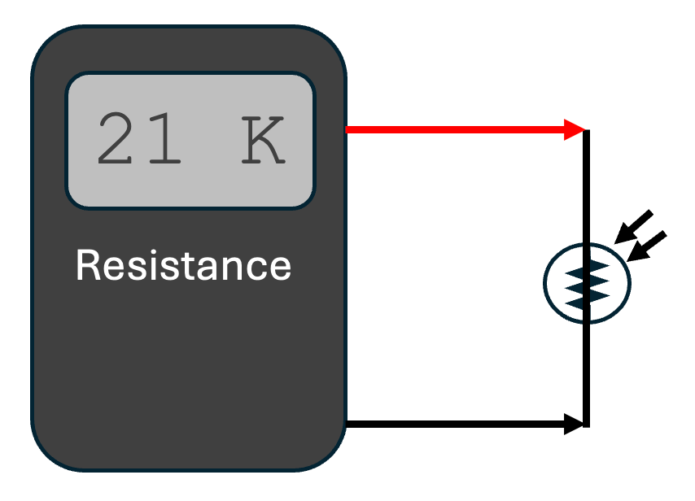
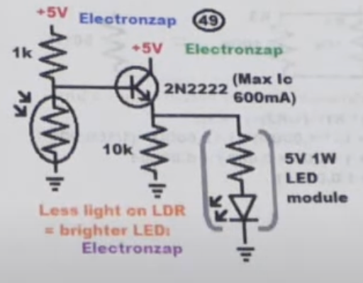

# LED Noodle Nightlight

We can create a nightlight that only goes on at night
by adding a photo-sensor to our LED circuit.
[https://youtube.com/shorts/LriJtNihyxY?si=2bpKlWYxMg4UexWk](https://youtube.com/shorts/LriJtNihyxY?si=2bpKlWYxMg4UexWk)

In this circuit, there is a 22K ohm resistor that connects the base of the
2N2222 transistor to the +5 volt power rail.

Note that because there is a voltage drop across the 2N2222 transistor, we can
omit the 15 ohm current limiting resistor we need for a 5 volt power supply.

!!! Warning
    Be carful when connected the LED noodle.  
    We never want to directly connect the LED
    noodle directly to +5 volts and GND.  
    We suggest ALWAYS having a 15 ohm resistor
    in series with the LED noodle when testing so you don't accidentally
    burn out the LED noodle using a 5-volt power supply.

## Light Dependant Resistors

The photo-sensor we use is called a light-dependant-resistor or (LDR).  The LDR high resistance when it is dark, but when there is light shining on the sensor the resistance is low.  
In our circuit, light on the LDR pulls the voltage of the base
down to ground and shuts off the flow of current between the collector and the emitter.

When it is dark, the resistance of the LDR is high, which causes
the 10K bias resistor to pull the base up to 5V.  This lets
the current flow between the collector and the emitter.

LDR sensors are inexpensive.  You can typically get 30 of them on eBay
for under $2.

You can also combine them in parallel to create very sensitive sensors.

## Measuring On and Off Resistance

To create the right sensitivity of the nightlight, we need to
carefully measure the resistance of your LDR under different lighting conditions.
This is easy to do with a standard digital multimeter set to measure the resistance
of a circuit.

In the circuit above, I wrapped the bottom part of the LED in black electrical tape
and then measured the resistance in two conditions:

1. When the LDR was uncovered - which gave a resistance across the LDR of about 20K ohms.
2. When the LDR was covered by my finger (which still transmitted some light) - which gave a resistance of about 2K ohms.

I tried various different values of resistors using a 50K potentiometer.

The value that gave me the best value for testing in my classroom was a 22K ohm resistor.
The value of resistor that you use for the bias resistor might vary depending
on how sensitive your LDR is and how bright your room lights are.

You can also test the extreme values of the LDR by completely covering the LDR
with black electrical tape which should give you a resistance of close to one megohm.

You can also shine a bright flashlight directly on the LDR to get a resistance of
around 100 ohms. 

## Dividing the Voltage

This circuit illustrates the concept of a "voltage divider".  A voltage divider uses two resistor in series between the rails of a power supply.
When you measure the voltage of the center between the resistors, the voltage is somewhere between the positive voltage and ground.  The exact value is a ratio of the resistors.

For example, if you have a 10K on the top and a 20K on the bottom, the value will be 1/3 of the way between the top and the bottom.

In the case of the LDR, we can measure the resistance with light and without light and select a pull-up resistor that is about 1/2 the value of the on and off resistances.

## Project Ideas

You can cover the LED Noodle with a cutout of a pumpkin for Halloween or make a star or Christmas tree glow at night, but stay off during the day.

## References

[Build Electronics Circuits](https://www.build-electronic-circuits.com/night-light-circuit/) - This version uses a similar circuit, but it uses a 9-volt battery, a 100K resistor and a BC947 transistor.  However, the principal is the same.

This one uses a 1K resistor for the top of the voltage divider.

[LDR and 2N2222A (beginner) on electronics.stackexchainge.com](https://electronics.stackexchange.com/questions/698467/ldr-and-2n2222a-beginner)

[Circuit on CircuitDiagram.com](http://www.circuitdiagram.org/dark-detector-led-ldr.html) note the pot in series with a 1K to tune the sensitivity.  The 50K variable resistor (VR) is used to adjust the desired light condition on which the LED will light up and 1K resistor is used to protect the LDR from direct connecting to the supply when the 50K variable resistor is on zero.