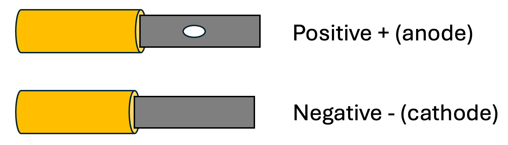
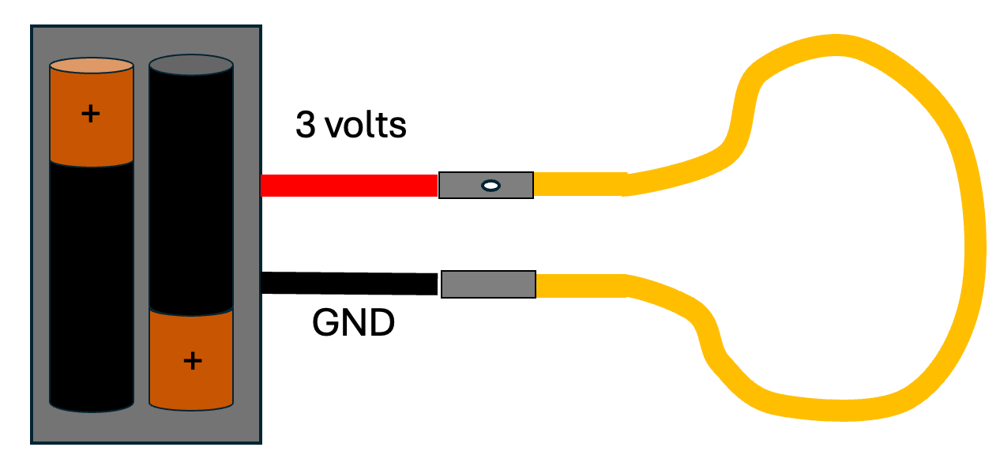
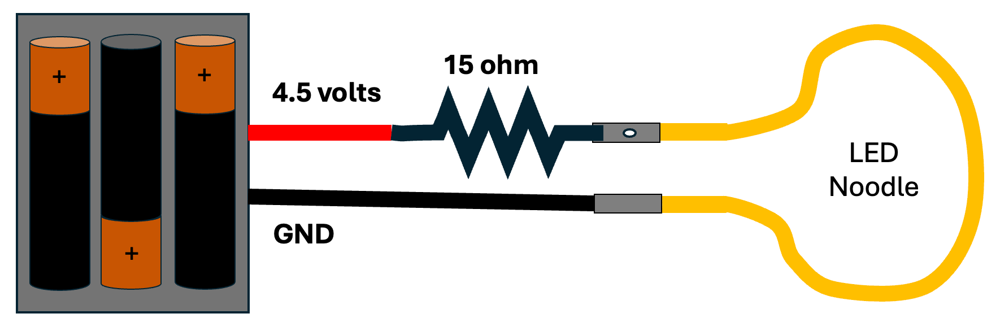
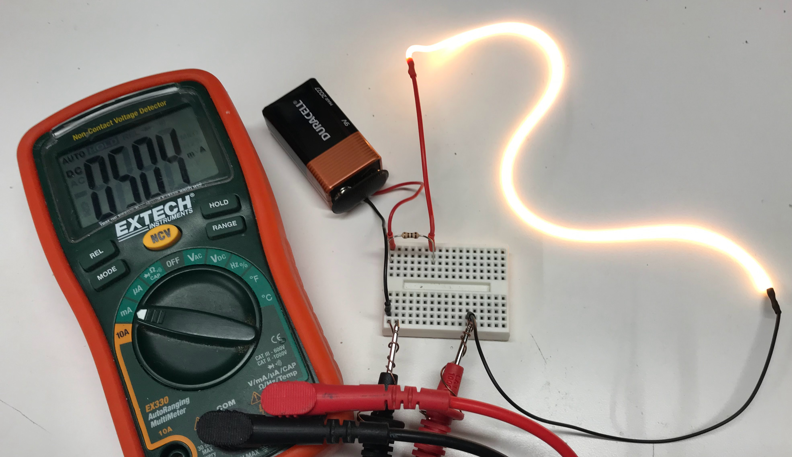
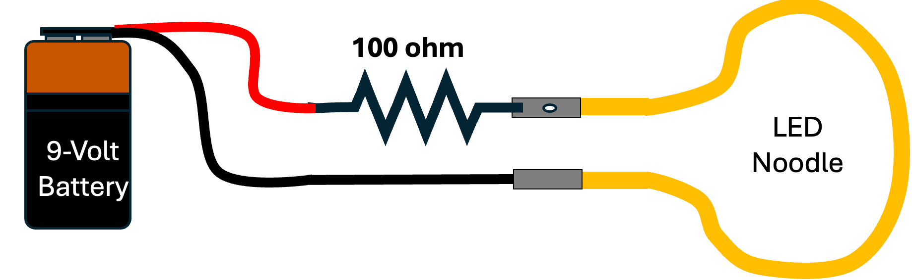
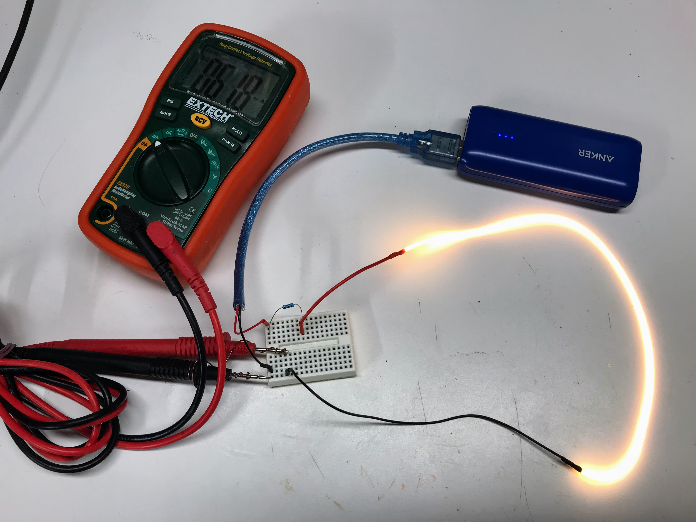

# Static Circuits

## LED Noodle Polarity

## Two AA or AAA Battery Power

This simple circuit has just two AA or AA batteries.  Each has a voltage of 1.5 volts.  When they are configured in series, the voltages of
each battery is added together to give a voltage of 3 volts.
This is exactly the recommended voltage for the LED Noodle!

Connect the terminals directly to the battery pack.
Make sure that the positive polarity is connected to the
end with the hole.  We used a soldering iron and standard
tin-lead solder with a low melting point and that
did not impact any of our LED noodles.

## Three AA or AAA Battery Power

If we need a little longer battery power, we can
upgrade from two batteries to three.  This gives
us a combined voltage of 4.5 volts (3 x 1.5 volts).

To limit the current, we will need a a 15 ohm current-limiting resistor in series with a battery pack.

It is possible to use slightly different values
of the current-limiting resistor.  A 10-ohm resistor
will give a brighter light, but will drain the batteries
faster.

[LED Noodle Calculator](https://editor.p5js.org/dmccreary/sketches/5ITU8lFU2)

## 9-Volt Battery

Although they are not commonly used in our labs, in a pinch you can
also use a 9-volt battery to light up the LED noodles.

Use a 100 ohm resistor in series with the battery.

9-volt batteries are easy to connect but they don't offer
the best value compared to AA batteries.

## USB Battery Packs

One great option is to use a rechargeable USB battery pack.
These supply 5 volts and because they are rechargeable, they
can be used many times over and over.

In the diagram above, we used a 20 ohm resistor in series with
the LED noodle to limit the current to about 62 milliamps.  This
is more than bright enough for most applications.  A 50 ohm
resistor is also a good option and the battery will last considerably
longer, but the LED will not be as bright.

