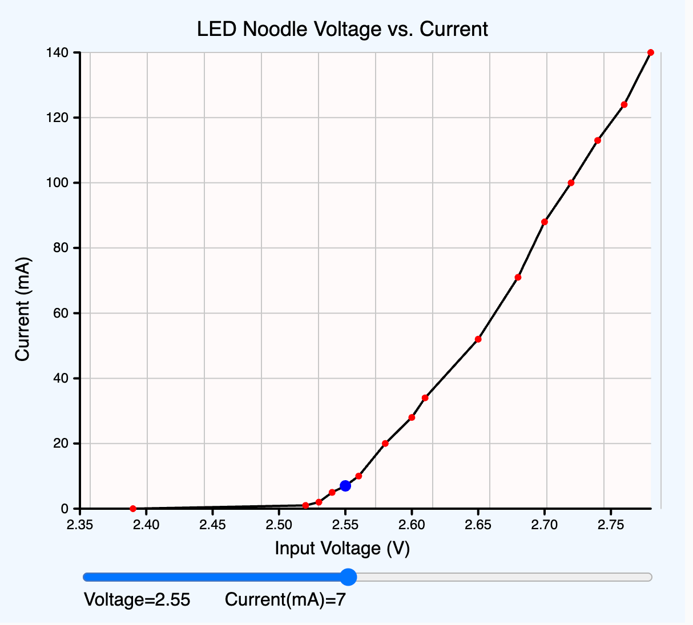

# Voltage Current Curve

## Collecting Data

Using a DC power supply, we can measure the exact voltage across the LED filament as well
as the current.  Here is a sample table of the current drawn for each voltage
from 2.39 to 2.8 volts.

|Voltage(v)|Current(mA)|
|------:|------:|
|2.39|0|
|2.52|1|
|2.53|2|
|2.54|5|
|2.55|7|
|2.56|10|
|2.58|22|
|2.60|28|
|2.61|34|
|2.65|52|
|2.68|71|
|2.70|88|
|2.72|100|
|2.74|113|
|2.6|124|
|2.8|140|

## Plotting These Values
Here is a plot of these values:



## Creating an Interactive MicroSimulation

[Link to Interactive Simulation](https://editor.p5js.org/dmccreary/sketches/Jl2wvEIJc)

Note that this simulation was mostly created by ChatGPT o1-preview.  I
had to adjust a few lines to make the plot a little more presentable.

Here are the key aspects of this MicroSimulation:

-   **Plot Area:** The plot occupies a central area within the canvas, with margins for labels and tick marks.
-   **Background:** The canvas background is set to "aliceblue" for a pleasant visual effect.
-   **Gridlines:** Light gray gridlines divide the plot area into a 10x10 grid for better readability.
-   **Axes:** Both axes are drawn with thicker lines and include tick marks and labels.
-   **Data Curve:** The voltage vs. current curve is drawn by interpolating between the provided data points.
-   **Data Points:** Original data points are highlighted as red circles for emphasis.
-   **Interactive Dot:** A blue dot moves along the curve as you adjust the voltage slider, indicating the current at that voltage.

Here is the ChatGPT prompt that I used:

```linenums="0"
Create a p5.js sketch on a 600x600 canvas that shows the current
when an input voltage changes, the current also changes in an LED circuit.

Make the background of the canvas be "aliceblue". 
Make a single-line plot with voltage on the horizontal axis and current on the vertical axis.
Make the title of the plot be "LED Noodle Voltage vs. Current".
Label the vertical axis "Current" and the horizontal axis "Voltage".

Make the gridlines be light gray.
Add axis labels for both the current and the voltage.
Add a slider at the bottom of the canvas that allows the user to change the voltage from 2.35 up to 2.78 in steps of 0.01 with the default value of 2.55.
When the user adjusts the slider, move a blue dot along the curve.

Use the following data to draw the curve.  Draw the data points with a red circle.

|Voltage(v)|Current(mA)|
|------:|------:|
|2.39|0|
|2.52|1|
|2.53|2|
|2.54|5|
|2.55|7|
|2.56|10|
|2.58|22|
|2.60|28|
|2.61|34|
|2.65|52|
|2.68|71|
|2.70|88|
|2.72|100|
|2.74|113|
|2.6|124|
|2.8|140|
```

## Estimating the Current with a Function

Although our data gives us some precise data, there are always variables
in our measurements.  However, we can see that the behavior of the
current falls under two regions.  Below about 2.5 volts the current
is essential zero.  Above 2.5 volts the curve is mostly a line with
a little curve in it that shows an slight exponential growth.

We can come up with a formula to approximate this using the following function:

```javascript
function calculateCurrent(v) {
  if (v <= 2.5) {
    return 0;
  } else {
    let A = 0.3296; // in mA
    let B = 24; // per Volt
    let linearCurrent = A * 300 * (v - 2.5);
    let exponentialCurrent = 0.4 * Math.exp(B * (v - 2.5));
    let current = linearCurrent + exponentialCurrent;
    if (current > 140) current = 140; // Limit to maximum data point
    return current;
  }
}
```

You can explore more about this "curve fitting process" by
looking at my chat with [ChatGPT o1.preview](https://chatgpt.com/share/66f5b27f-4628-8001-b80d-2cf8d9fa420d).
