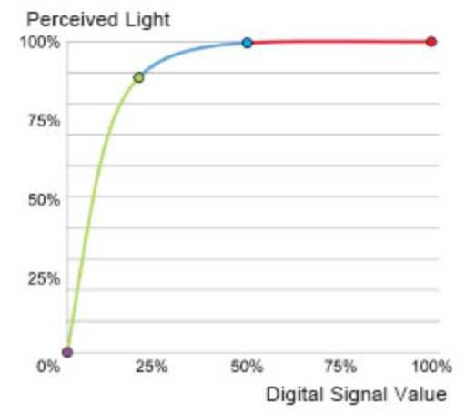
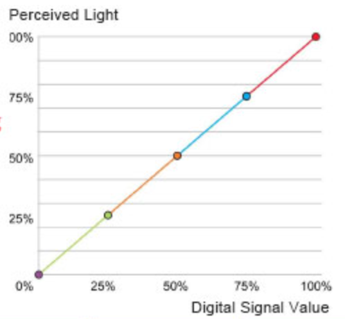

# Linear Dimmer
We can dim a single LED by using PWM or we can dim a NeoPixel by sending it a value from 0 to 255 for the brightness.





https://docs.micropython.org/en/latest/pyboard/tutorial/fading_led.html

## Gamma Correction Table

```python
gamma8= [
    0,  0,  0,  0,  0,  0,  0,  0,  0,  0,  0,  0,  0,  0,  0,  0,
    0,  0,  0,  0,  0,  0,  0,  0,  0,  0,  0,  0,  1,  1,  1,  1,
    1,  1,  1,  1,  1,  1,  1,  1,  1,  2,  2,  2,  2,  2,  2,  2,
    2,  3,  3,  3,  3,  3,  3,  3,  4,  4,  4,  4,  4,  5,  5,  5,
    5,  6,  6,  6,  6,  7,  7,  7,  7,  8,  8,  8,  9,  9,  9, 10,
   10, 10, 11, 11, 11, 12, 12, 13, 13, 13, 14, 14, 15, 15, 16, 16,
   17, 17, 18, 18, 19, 19, 20, 20, 21, 21, 22, 22, 23, 24, 24, 25,
   25, 26, 27, 27, 28, 29, 29, 30, 31, 32, 32, 33, 34, 35, 35, 36,
   37, 38, 39, 39, 40, 41, 42, 43, 44, 45, 46, 47, 48, 49, 50, 50,
   51, 52, 54, 55, 56, 57, 58, 59, 60, 61, 62, 63, 64, 66, 67, 68,
   69, 70, 72, 73, 74, 75, 77, 78, 79, 81, 82, 83, 85, 86, 87, 89,
   90, 92, 93, 95, 96, 98, 99,101,102,104,105,107,109,110,112,114,
  115,117,119,120,122,124,126,127,129,131,133,135,137,138,140,142,
  144,146,148,150,152,154,156,158,160,162,164,167,169,171,173,175,
  177,180,182,184,186,189,191,193,196,198,200,203,205,208,210,213,
  215,218,220,223,225,228,231,233,236,239,241,244,247,249,252,255]
```

```python
## Gamma Correction Function
# input is an integer from 0 to 255
def gamma8(input):
    return gamma8[input]
```