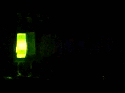

# Theater Chase



Theater [Chase](https://en.wikipedia.org/wiki/Chase_(lighting)) is a classic pattern that was popularized in [marquee](https://en.wikipedia.org/wiki/Marquee_(structure)) signs above movie theaters.  It consists of a row of lights that were usually switched on and off so it would appear that the lights were moving or being chased around the edge of the signs.

## Sample Theater Chase Function

To create the illusion of pixels moving along a strip, we need to have three nested loops:

1. The inner "i" loop just moves from 0 to the number of pixels in steps of 3 (or a similarly small number).  It turns every 3rd pixel on, waits and then turns it off
2. The middle "q" loop just offsets the starting point of the inner loop moving from values of 0, 1 and 2.  The index in the inner loop is ```i+q```.
3. The outer-most "j" loop just indicates how many times the pattern should be repeated

Here is a sample of the ```theater_chase``` function that has four parameters:

1. the LED strip
2. the color
3. the delay (about 50 milliseconds)
4. the number of times the pattern should be repeated (iterations)

```python
def theater_chase(strip, color, wait_ms=50, iterations=10):
	for j in range(iterations):
		for q in range(3):
            # turn every third pixel on
			for i in range(0, strip.numPixels(), 3):
				strip[i+q] = color
			strip.write()
            # keep the pixels on for a bit like 1/20th of a second
			sleep_ms(wait_ms)
            # turn every third pixel off
			for i in range(0, strip.numPixels(), 3):
				strip.setPixelColor(i+q, 0)
```

If you want to lower the power of the LED strip, you can change the skip number in the inner loop from 3 to 4, 5 or 6 etc.

## Full Program

This program will run a theater chase for the seven colors of the rainbow and then repeat.

```python
from neopixel import NeoPixel
from utime import sleep, sleep_ms

NEOPIXEL_PIN = 0
NUMBER_PIXELS = 60
strip = NeoPixel(machine.Pin(NEOPIXEL_PIN), NUMBER_PIXELS)
# Color RGB values
red = (255, 0, 0)
orange = (255, 60, 0)
yellow = (255, 150, 0)
green = (0, 255, 0)
blue = (0, 0, 255)
indigo = (75, 0, 130)
violet = (138, 43, 226)
color_names = ('red', 'orange', 'yellow', 'green', 'blue', 'indigo', 'violet')
num_colors = len(color_names)
colors = (red, orange, yellow, green, blue, indigo, violet)

def theater_chase(strip, color, wait_ms=50, iterations=10):
	for j in range(iterations):
		for q in range(3):
			for i in range(0, strip.numPixels(), 3):
				strip[i+q] = color
			strip.write()
			sleep_ms(wait_ms)
			for i in range(0, strip.numPixels(), 3):
				strip.setPixelColor(i+q, 0)

while True:
    # iterate through all the colors
    for c in range(0, num_colors):
        theater_chase(strip, colors[c], wait_ms=50, iterations=50)
```

## Exercises

1. Add the skip number as an additional parameter to the function
2. Add another parameter that reversed the direction of the movement
3. Create a function that randomly changes the direction every few seconds