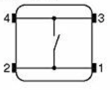

# Testing a Button

A **momentary push button** is a switch that is only on while you hold it
down. Let go, and it springs back off by itself. In this lesson you wire up
your first button and read it in code.

!!! tip "Pixel says..."
    Buttons are how your project finally gets to hear from *you*. Every
    lesson before this one just ran on its own. Let's light this up — and
    give it ears!

## What you'll learn

- What a momentary push button is and how it is different from a light switch
- How to wire a button using the Pico's built-in pull-up resistor
- How to read a button's value in code
- Why a pressed button reads as `0`, not `1`

## What you'll need

- A Raspberry Pi Pico on a breadboard
- One momentary push button
- Two jumper wires
- The kit's `config.py` file

## Wiring the Button

Your button has **four** legs, not two. The four legs are really two pairs,
and each pair is already joined together inside the button's case. If you
wire across a joined pair, the button acts like it is pressed all the time,
even when you're not touching it.



Wire across the button — corner to opposite corner — and you'll always be
using one leg from each pair. Connect one corner to pin `config.BUTTON_PIN_1`
(GPIO 15) and the opposite corner to GND (ground).

No resistor is needed. The Pico has a tiny resistor built into every GPIO
pin. Your code turns it on with `Pin.PULL_UP`.

## Reading the Button in Code

This program reads the button 10 times a second and prints what it sees.

```python
# Print the raw value of a button every tenth of a second.
from machine import Pin
from utime import sleep
import config

button = Pin(config.BUTTON_PIN_1, Pin.IN, Pin.PULL_UP)

while True:
    print(button.value())
    sleep(0.1)   # wait a tenth of a second
```

Run it in Thonny and watch the Shell. You should see a stream of `1`s. Now
hold the button down — the stream switches to `0`. Let go, and it's back
to `1`.

!!! info "Pixel thinks..."
    That might feel backwards at first. With `PULL_UP`, the pin normally
    sits at 3.3 volts, which reads as `1`. Pressing the button connects the
    pin straight to ground, which reads as `0`. So remember: pressed
    means zero.

## Try It Yourself

- Change `sleep(0.1)` to `sleep(1)`. Is it harder or easier to catch a
  quick press?
- Instead of printing `0` or `1`, print the word `"pressed"` or
  `"released"` using an `if` statement.

## Check Your Understanding

1. What happens to the circuit inside a momentary button when you let go of it?
2. Why do the four legs matter? What happens if you wire across a joined pair by mistake?
3. With `Pin.PULL_UP`, what value does the pin read when the button is not pressed?
4. What part inside the Pico means you don't need an extra resistor?

!!! success "You've got this!"
    Your project can now sense the outside world. Every interactive kit
    you build from here on starts with this exact same idea.

**What's next:** in [Button + Built-in LED](23-button-led-test.md), you'll
use this same button to turn the Pico's onboard LED on and off.
