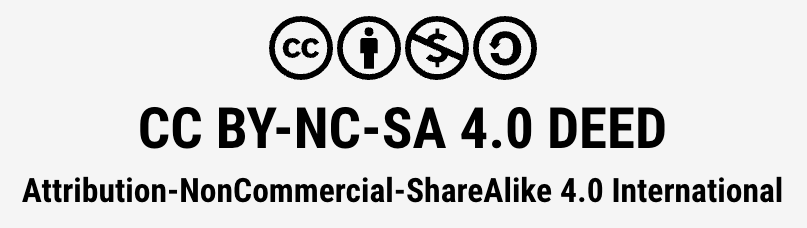

# Creative Commons License

All content in this repository is governed by the following license agreement:

## License Type

Attribution-NonCommercial-ShareAlike 4.0 International (CC BY-NC-SA 4.0 DEED)

## Link to License Agreement

[https://creativecommons.org/licenses/by-nc-sa/4.0/deed.en](https://creativecommons.org/licenses/by-nc-sa/4.0/deed.en)

## Your Rights

You are free to:

* **Share** — copy and redistribute the material in any medium or format
* **Adapt** — remix, transform, and build upon the material

The licensor cannot revoke these freedoms as long as you follow the license terms.

## Restrictions

* **Attribution** — You must give appropriate credit, provide a link to the license, and indicate if changes were made. You may do so in any reasonable manner, but not in any way that suggests the licensor endorses you or your use.
* **NonCommercial** — You may not use the material for commercial purposes.
* **ShareAlike** — If you remix, transform, or build upon the material, you must distribute your contributions under the same license as the original.
* **No additional restrictions** — You may not apply legal terms or technological measures that legally restrict others from doing anything the license permits.

!!! Notices
    You do not have to comply with the license for elements of the material in the public domain or where your use is permitted by an applicable exception or limitation.

    No warranties are given. The license may not give you all of the permissions necessary for your intended use. For example, other rights such as publicity, privacy, or moral rights may limit how you use the material.

    This deed highlights only some of the key features and terms of the actual license. It is not a license and has no legal value. You should carefully review all of the terms and conditions of the actual license before using the licensed material.

## Commercial Licensing

Commercial rights are reserved by the copyright holder. For commercial licensing, publication inquiries, or permission to use this work in commercial contexts, please contact [Dan McCreary on LinkedIn](https://www.linkedin.com/in/danmccreary/).