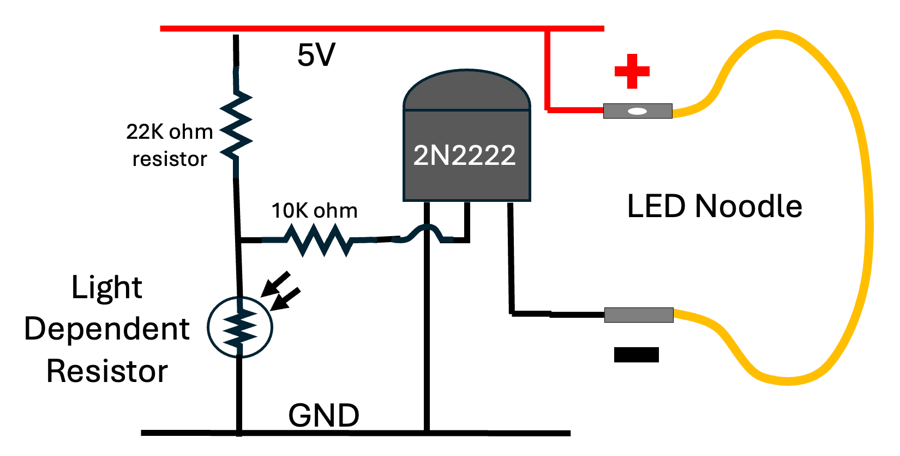

# LED Current Predictor

<iframe src="main.html" height="470"></iframe>

```html
<iframe src="main.html" height="400px" scrolling="no"></iframe>
```

[Edit this MicroSim](https://editor.p5js.org/dmccreary/sketches/lplKjgLgbR)

## Background

How do we limit the current going into our LEDs?  Many LEDs will
be destroyed if they get too much current.  How can we use a base
limiting resistor to limit the current that goes into an LED.


