# MicroSims

This book includes **42 interactive MicroSims** — self-contained, browser-based visualizations you can explore directly. Click any thumbnail to open the MicroSim.

<!-- This gallery is generated by generate-sims-index.py — edits here will be overwritten. -->

  <a href="additive-subtractive-mixing/" title="Additive vs. Subtractive Color Mixing" style="display:block;border:1px solid #e3e7ec;border-radius:8px;overflow:hidden;text-decoration:none;color:inherit;box-shadow:0 1px 3px rgba(0,0,0,0.08);">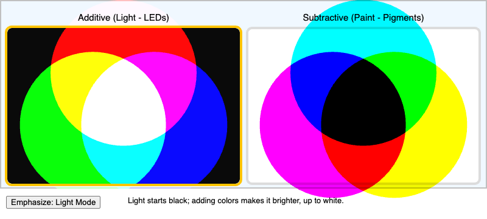Additive vs. Subtractive Color Mixing</a>
  <a href="animation-pattern-comparison/" title="Animation Pattern Comparison" style="display:block;border:1px solid #e3e7ec;border-radius:8px;overflow:hidden;text-decoration:none;color:inherit;box-shadow:0 1px 3px rgba(0,0,0,0.08);">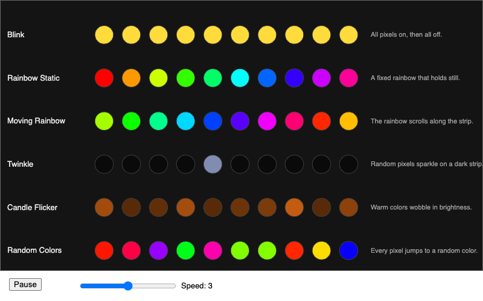Animation Pattern Comparison</a>
  <a href="battery-life-calculator/" title="Battery Life Calculator" style="display:block;border:1px solid #e3e7ec;border-radius:8px;overflow:hidden;text-decoration:none;color:inherit;box-shadow:0 1px 3px rgba(0,0,0,0.08);">no previewBattery Life Calculator</a>
  <a href="break-continue-flowchart/" title="break vs. continue Flow" style="display:block;border:1px solid #e3e7ec;border-radius:8px;overflow:hidden;text-decoration:none;color:inherit;box-shadow:0 1px 3px rgba(0,0,0,0.08);">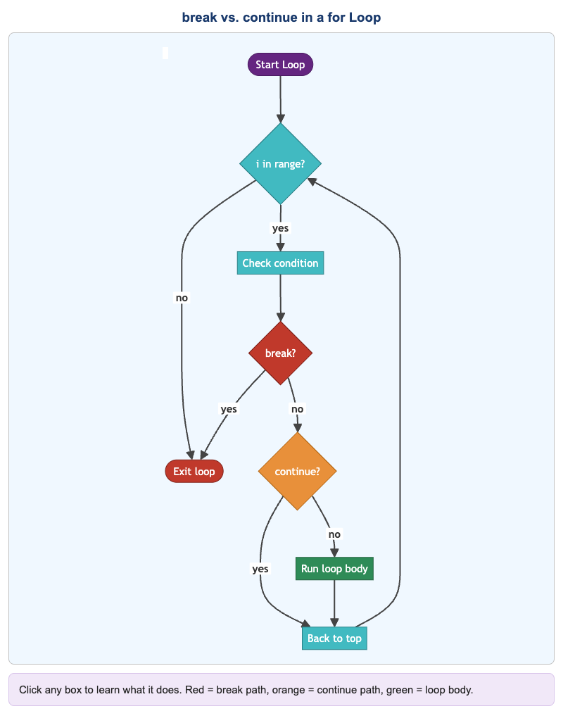break vs. continue Flow</a>
  <a href="brightness-envelope-comparison/" title="Brightness Envelopes for Advanced Patterns" style="display:block;border:1px solid #e3e7ec;border-radius:8px;overflow:hidden;text-decoration:none;color:inherit;box-shadow:0 1px 3px rgba(0,0,0,0.08);">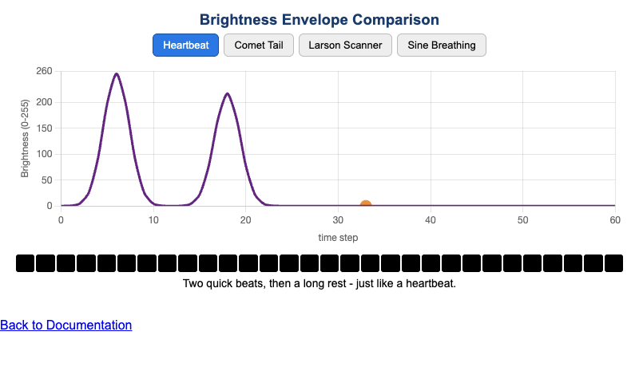Brightness Envelopes for Advanced Patterns</a>
  <a href="claude-code-hooks-workflow/" title="Claude Code Hooks Workflow" style="display:block;border:1px solid #e3e7ec;border-radius:8px;overflow:hidden;text-decoration:none;color:inherit;box-shadow:0 1px 3px rgba(0,0,0,0.08);">no previewClaude Code Hooks Workflow</a>
  <a href="code-indentation-explorer/" title="Code Indentation Explorer" style="display:block;border:1px solid #e3e7ec;border-radius:8px;overflow:hidden;text-decoration:none;color:inherit;box-shadow:0 1px 3px rgba(0,0,0,0.08);">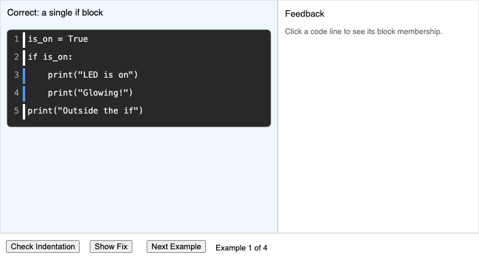Code Indentation Explorer</a>
  <a href="color-wheel/" title="Color Wheel MicroSim" style="display:block;border:1px solid #e3e7ec;border-radius:8px;overflow:hidden;text-decoration:none;color:inherit;box-shadow:0 1px 3px rgba(0,0,0,0.08);">no previewColor Wheel MicroSim</a>
  <a href="decomposition-in-action/" title="Decomposition in Action" style="display:block;border:1px solid #e3e7ec;border-radius:8px;overflow:hidden;text-decoration:none;color:inherit;box-shadow:0 1px 3px rgba(0,0,0,0.08);">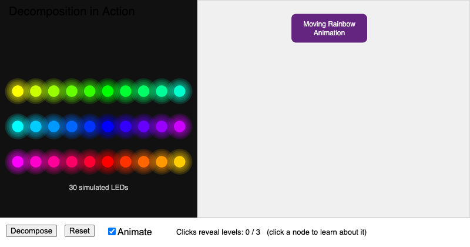Decomposition in Action</a>
  <a href="dry-principle-before-after/" title="DRY Principle Before and After" style="display:block;border:1px solid #e3e7ec;border-radius:8px;overflow:hidden;text-decoration:none;color:inherit;box-shadow:0 1px 3px rgba(0,0,0,0.08);">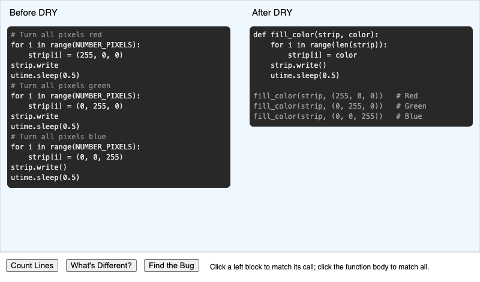DRY Principle Before and After</a>
  <a href="bike-light-circuit-diagram/" title="Example Circuit Connection Diagram for Bike Light Project" style="display:block;border:1px solid #e3e7ec;border-radius:8px;overflow:hidden;text-decoration:none;color:inherit;box-shadow:0 1px 3px rgba(0,0,0,0.08);">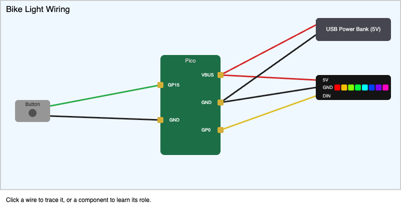Example Circuit Connection Diagram for Bike Light Project</a>
  <a href="project-lifecycle-timeline/" title="Full Project Lifecycle" style="display:block;border:1px solid #e3e7ec;border-radius:8px;overflow:hidden;text-decoration:none;color:inherit;box-shadow:0 1px 3px rgba(0,0,0,0.08);">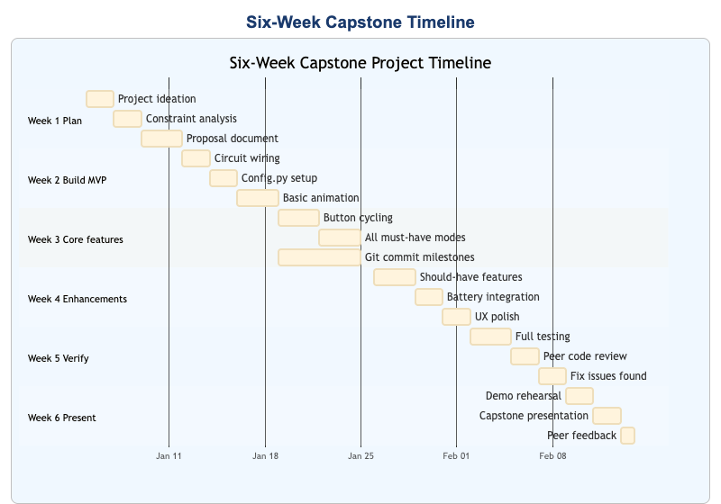Full Project Lifecycle</a>
  <a href="function-call-step-through/" title="Function Call Step-Through" style="display:block;border:1px solid #e3e7ec;border-radius:8px;overflow:hidden;text-decoration:none;color:inherit;box-shadow:0 1px 3px rgba(0,0,0,0.08);">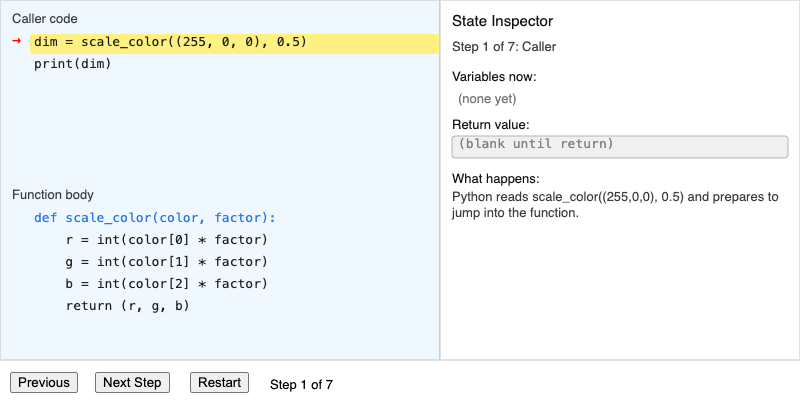Function Call Step-Through</a>
  <a href="git-workflow-diagram/" title="Git Workflow" style="display:block;border:1px solid #e3e7ec;border-radius:8px;overflow:hidden;text-decoration:none;color:inherit;box-shadow:0 1px 3px rgba(0,0,0,0.08);">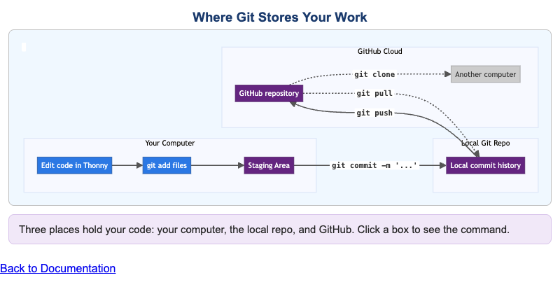Git Workflow</a>
  <a href="for-loop-list-iteration/" title="How a for Loop Iterates Over a List" style="display:block;border:1px solid #e3e7ec;border-radius:8px;overflow:hidden;text-decoration:none;color:inherit;box-shadow:0 1px 3px rgba(0,0,0,0.08);">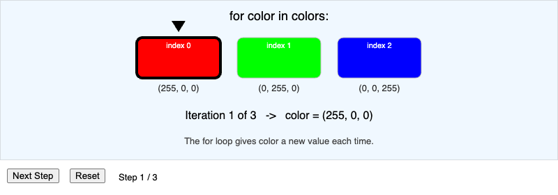How a for Loop Iterates Over a List</a>
  <a href="hsv-color-explorer/" title="HSV Color Space Explorer" style="display:block;border:1px solid #e3e7ec;border-radius:8px;overflow:hidden;text-decoration:none;color:inherit;box-shadow:0 1px 3px rgba(0,0,0,0.08);">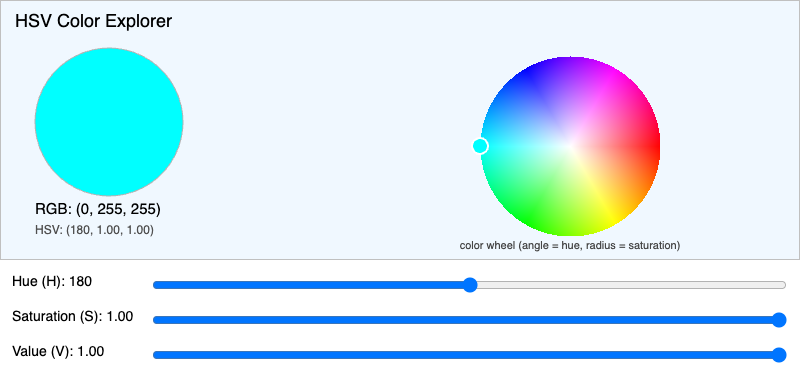HSV Color Space Explorer</a>
  <a href="iterative-dev-simulator/" title="Iterative Development Simulator" style="display:block;border:1px solid #e3e7ec;border-radius:8px;overflow:hidden;text-decoration:none;color:inherit;box-shadow:0 1px 3px rgba(0,0,0,0.08);">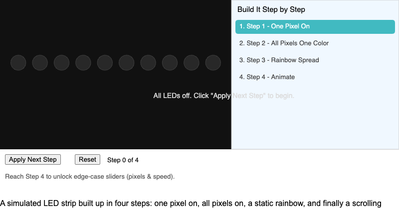Iterative Development Simulator</a>
  <a href="graph-viewer/" title="Learning Graph Viewer" style="display:block;border:1px solid #e3e7ec;border-radius:8px;overflow:hidden;text-decoration:none;color:inherit;box-shadow:0 1px 3px rgba(0,0,0,0.08);">no previewLearning Graph Viewer</a>
  <a href="current-predictor/" title="LED Current Predictor" style="display:block;border:1px solid #e3e7ec;border-radius:8px;overflow:hidden;text-decoration:none;color:inherit;box-shadow:0 1px 3px rgba(0,0,0,0.08);">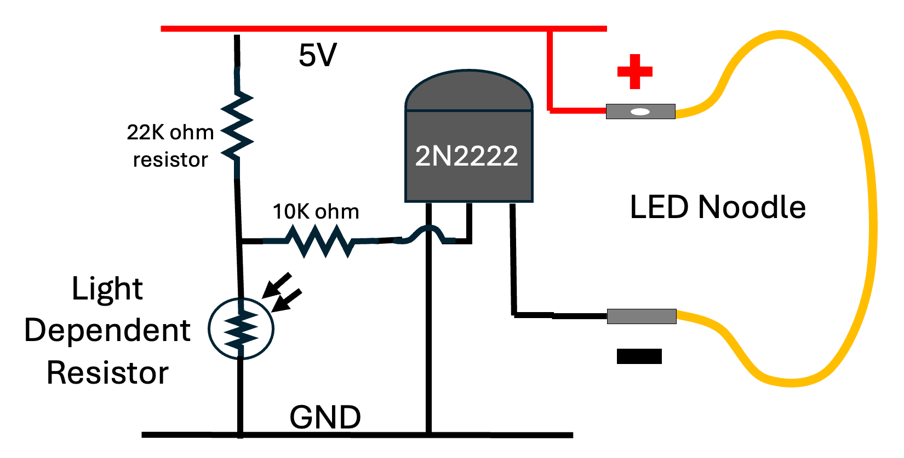LED Current Predictor</a>
  <a href="led-dimmer/" title="LED Dimmer Circuit" style="display:block;border:1px solid #e3e7ec;border-radius:8px;overflow:hidden;text-decoration:none;color:inherit;box-shadow:0 1px 3px rgba(0,0,0,0.08);">no previewLED Dimmer Circuit</a>
  <a href="nightlight/" title="LED Nightlight Circuit" style="display:block;border:1px solid #e3e7ec;border-radius:8px;overflow:hidden;text-decoration:none;color:inherit;box-shadow:0 1px 3px rgba(0,0,0,0.08);">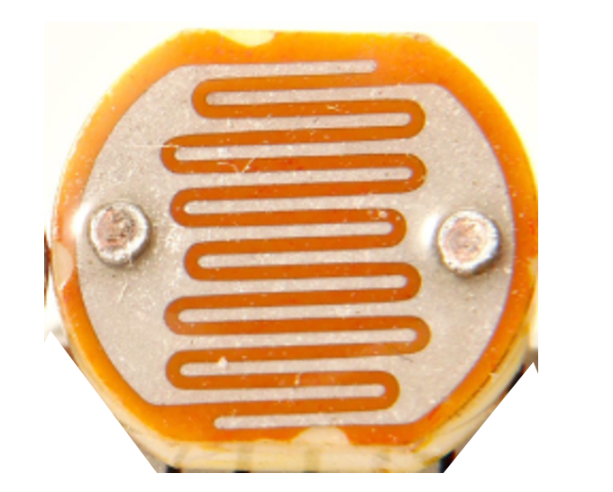LED Nightlight Circuit</a>
  <a href="animation-math-explorer/" title="Math Functions in Animation" style="display:block;border:1px solid #e3e7ec;border-radius:8px;overflow:hidden;text-decoration:none;color:inherit;box-shadow:0 1px 3px rgba(0,0,0,0.08);">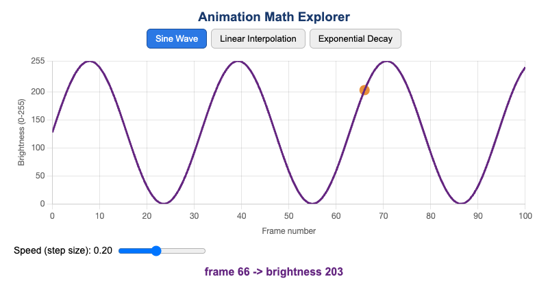Math Functions in Animation</a>
  <a href="micropython-api-connections/" title="MicroPython API Connections" style="display:block;border:1px solid #e3e7ec;border-radius:8px;overflow:hidden;text-decoration:none;color:inherit;box-shadow:0 1px 3px rgba(0,0,0,0.08);">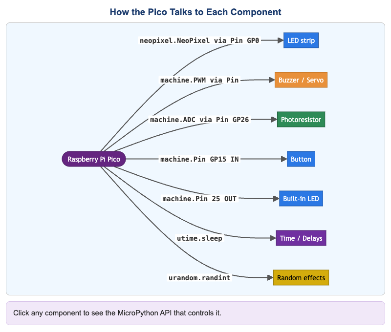MicroPython API Connections</a>
  <a href="animated-wire/" title="MicroSim Template" style="display:block;border:1px solid #e3e7ec;border-radius:8px;overflow:hidden;text-decoration:none;color:inherit;box-shadow:0 1px 3px rgba(0,0,0,0.08);">no previewMicroSim Template</a>
  <a href="modulo-wrap-simulation/" title="Modulo Wrap-Around Animation" style="display:block;border:1px solid #e3e7ec;border-radius:8px;overflow:hidden;text-decoration:none;color:inherit;box-shadow:0 1px 3px rgba(0,0,0,0.08);">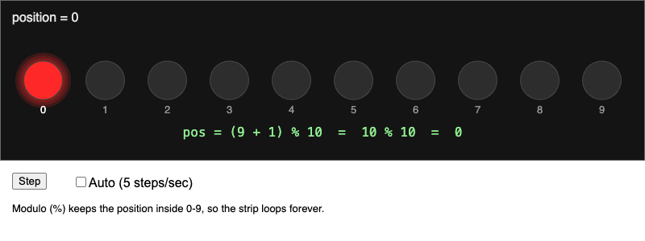Modulo Wrap-Around Animation</a>
  <a href="graph-viewer-v1/" title="Moving Rainbow Learning Graph" style="display:block;border:1px solid #e3e7ec;border-radius:8px;overflow:hidden;text-decoration:none;color:inherit;box-shadow:0 1px 3px rgba(0,0,0,0.08);">no previewMoving Rainbow Learning Graph</a>
  <a href="neopixel-wiring-diagram/" title="NeoPixel Wiring Diagram" style="display:block;border:1px solid #e3e7ec;border-radius:8px;overflow:hidden;text-decoration:none;color:inherit;box-shadow:0 1px 3px rgba(0,0,0,0.08);">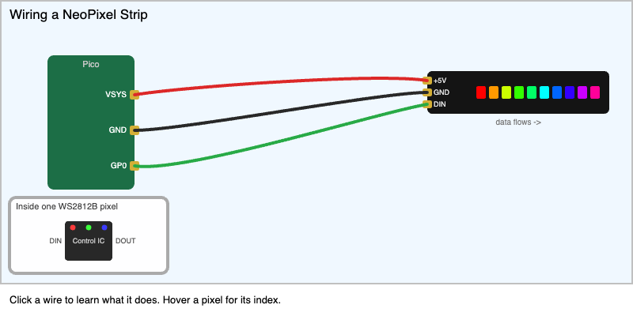NeoPixel Wiring Diagram</a>
  <a href="ohms-law-calculator/" title="Ohm&#x27;s Law Calculator" style="display:block;border:1px solid #e3e7ec;border-radius:8px;overflow:hidden;text-decoration:none;color:inherit;box-shadow:0 1px 3px rgba(0,0,0,0.08);">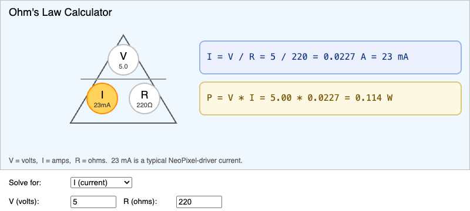Ohm&#x27;s Law Calculator</a>
  <a href="perceived-vs-linear-brightness/" title="Perceived vs. Linear Brightness" style="display:block;border:1px solid #e3e7ec;border-radius:8px;overflow:hidden;text-decoration:none;color:inherit;box-shadow:0 1px 3px rgba(0,0,0,0.08);">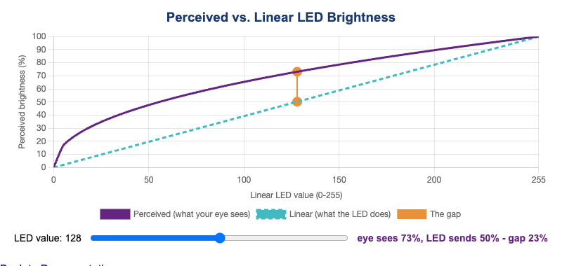Perceived vs. Linear Brightness</a>
  <a href="photoresistor-component/" title="Photoresistor Component Visualization" style="display:block;border:1px solid #e3e7ec;border-radius:8px;overflow:hidden;text-decoration:none;color:inherit;box-shadow:0 1px 3px rgba(0,0,0,0.08);">no previewPhotoresistor Component Visualization</a>
  <a href="pico-light-sensor/" title="Pico Light Sensor Circuit" style="display:block;border:1px solid #e3e7ec;border-radius:8px;overflow:hidden;text-decoration:none;color:inherit;box-shadow:0 1px 3px rgba(0,0,0,0.08);">no previewPico Light Sensor Circuit</a>
  <a href="pixel-indexing-explorer/" title="Pixel Indexing on a NeoPixel Strip" style="display:block;border:1px solid #e3e7ec;border-radius:8px;overflow:hidden;text-decoration:none;color:inherit;box-shadow:0 1px 3px rgba(0,0,0,0.08);">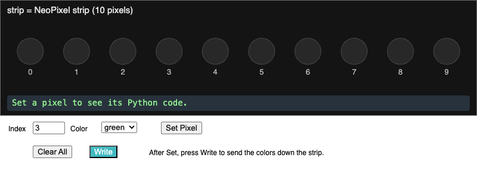Pixel Indexing on a NeoPixel Strip</a>
  <a href="problem-solving-steps/" title="Problem-Solving Steps Flowchart" style="display:block;border:1px solid #e3e7ec;border-radius:8px;overflow:hidden;text-decoration:none;color:inherit;box-shadow:0 1px 3px rgba(0,0,0,0.08);">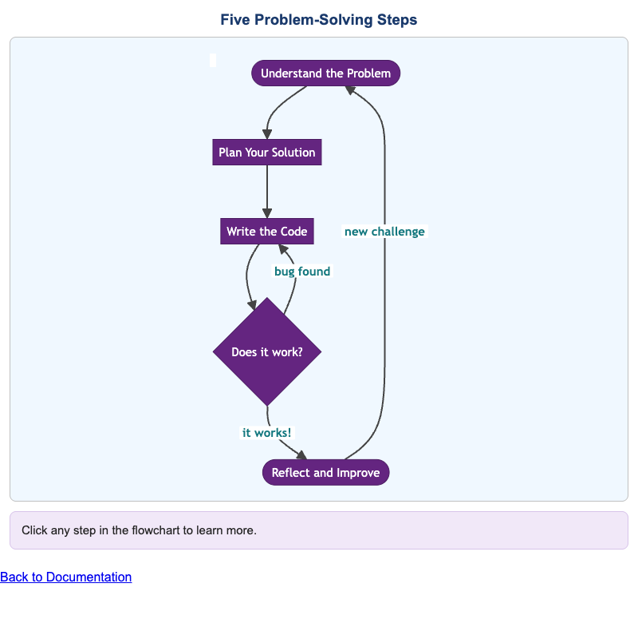Problem-Solving Steps Flowchart</a>
  <a href="python-data-type-explorer/" title="Python Data Type Explorer" style="display:block;border:1px solid #e3e7ec;border-radius:8px;overflow:hidden;text-decoration:none;color:inherit;box-shadow:0 1px 3px rgba(0,0,0,0.08);">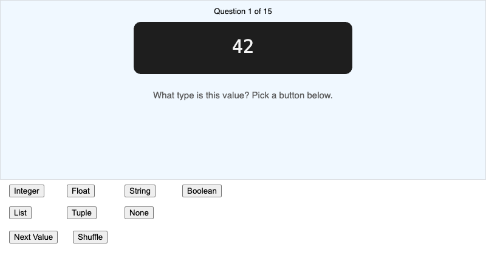Python Data Type Explorer</a>
  <a href="python-operator-playground/" title="Python Operator Playground" style="display:block;border:1px solid #e3e7ec;border-radius:8px;overflow:hidden;text-decoration:none;color:inherit;box-shadow:0 1px 3px rgba(0,0,0,0.08);">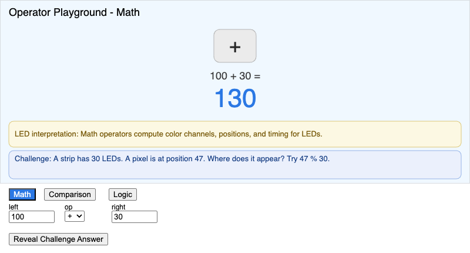Python Operator Playground</a>
  <a href="pico-hardware-overview/" title="Raspberry Pi Pico Hardware Overview" style="display:block;border:1px solid #e3e7ec;border-radius:8px;overflow:hidden;text-decoration:none;color:inherit;box-shadow:0 1px 3px rgba(0,0,0,0.08);">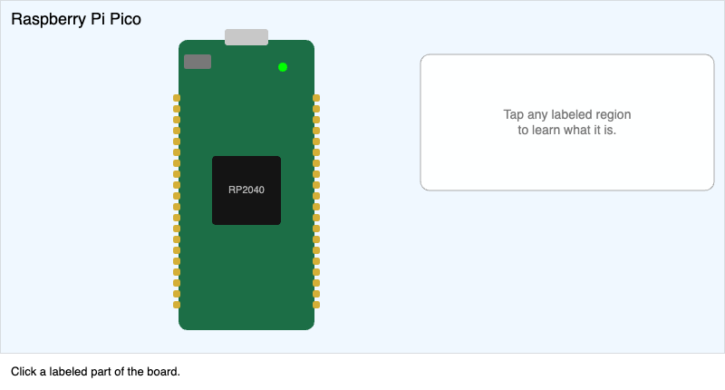Raspberry Pi Pico Hardware Overview</a>
  <a href="ripple-animation-sim/" title="Ripple Animation Mechanics" style="display:block;border:1px solid #e3e7ec;border-radius:8px;overflow:hidden;text-decoration:none;color:inherit;box-shadow:0 1px 3px rgba(0,0,0,0.08);">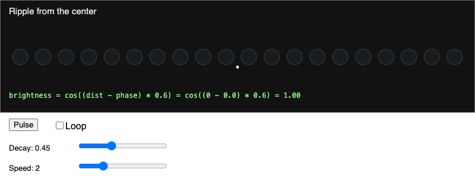Ripple Animation Mechanics</a>
  <a href="solar-powered-nightlight/" title="Solar Powered Nightlight" style="display:block;border:1px solid #e3e7ec;border-radius:8px;overflow:hidden;text-decoration:none;color:inherit;box-shadow:0 1px 3px rgba(0,0,0,0.08);">no previewSolar Powered Nightlight</a>
  <a href="state-machine-diagram/" title="State Machine for a 3-Mode LED Controller" style="display:block;border:1px solid #e3e7ec;border-radius:8px;overflow:hidden;text-decoration:none;color:inherit;box-shadow:0 1px 3px rgba(0,0,0,0.08);">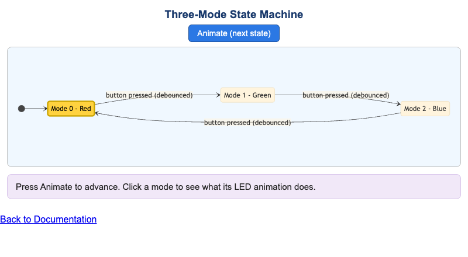State Machine for a 3-Mode LED Controller</a>
  <a href="templates/" title="Title of this MicroSim" style="display:block;border:1px solid #e3e7ec;border-radius:8px;overflow:hidden;text-decoration:none;color:inherit;box-shadow:0 1px 3px rgba(0,0,0,0.08);">no previewTitle of this MicroSim</a>
  <a href="transistor-circuit-diagrams/" title="Transistor Driver and Dimmer Circuit" style="display:block;border:1px solid #e3e7ec;border-radius:8px;overflow:hidden;text-decoration:none;color:inherit;box-shadow:0 1px 3px rgba(0,0,0,0.08);">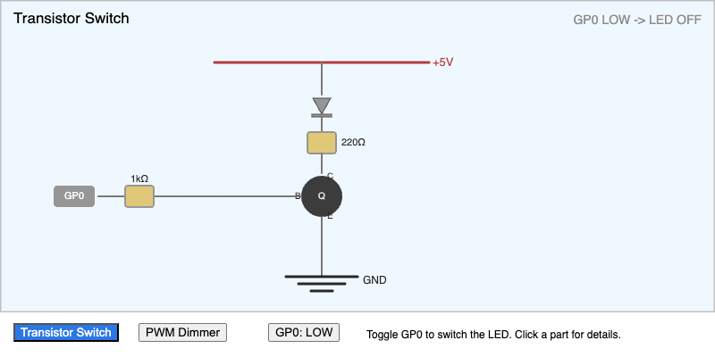Transistor Driver and Dimmer Circuit</a>
  <a href="variable-scope-explorer/" title="Variable Scope Explorer" style="display:block;border:1px solid #e3e7ec;border-radius:8px;overflow:hidden;text-decoration:none;color:inherit;box-shadow:0 1px 3px rgba(0,0,0,0.08);">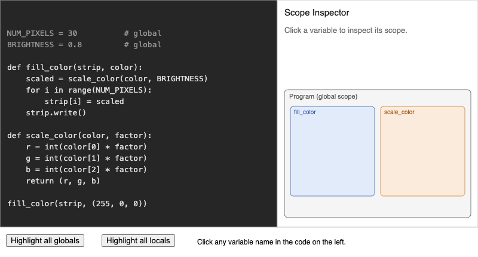Variable Scope Explorer</a>

