# The Scanning Eye: Glen Larson's Iconic LED Pattern

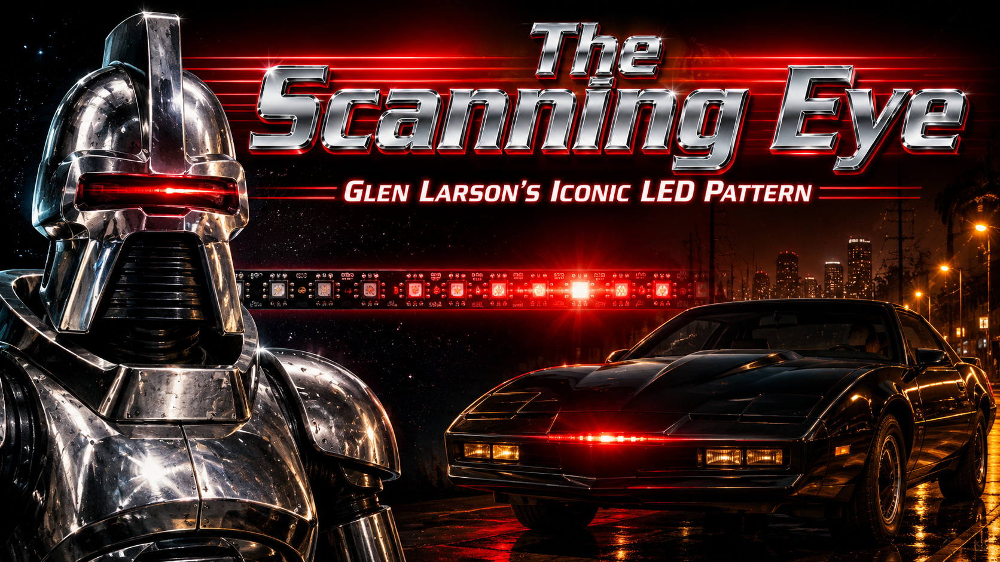

Cover Image Prompt

(This is the Cover Image. Do not include this label in the image.)
Please generate a wide-landscape 16:9 cover image for this graphic novel story in bold cinematic 1980s Hollywood graphic novel style. The cover depicts a dramatic split composition: on the left, a gleaming silver Cylon Centurion robot from 1978 science fiction television with a single red scanning light sweeping left to right across a horizontal visor slot; on the right, a sleek black 1982 Pontiac Trans Am sports car at night with a glowing red scanner light sweeping back and forth across its front bumper. Both red lights trace the same iconic arc pattern. In the center background, a strip of NeoPixel LEDs glows red in the same back-and-forth scanning pattern, connecting past to future. Above, the title text "The Scanning Eye" appears in bold chrome-effect letters with a red LED glow behind them, and below it "Glen Larson's Iconic LED Pattern" in smaller text. Color palette: deep blacks, chrome silvers, vivid red LED glow against darkness, with warm amber street lighting on the car side. Emotional tone: exciting, futuristic, iconic — like a movie poster from the 1980s with modern graphic novel polish. Generate the image immediately without asking clarifying questions.

Narrative Prompt

This graphic novel tells the story of Glen A. Larson (1937–2014), the prolific American television producer who created the iconic back-and-forth LED scanning light pattern — now called the "Larson Scanner" — through his landmark TV shows Battlestar Galactica (1978) and Knight Rider (1982). The story follows Glen from his early days as a musician in 1950s Los Angeles through his transformation into one of the most successful TV producers of the 1970s and 1980s, and traces how his visual design choice — a simple back-and-forth scanning red light to make robots and cars feel "alive" — became one of the most beloved LED patterns in the modern maker community.

Art style throughout: Bold cinematic graphic novel illustration with warm 1980s Hollywood color palette. Use deep reds, chrome silvers, television amber, and dark navy. Digital painting style with clean confident lines and dramatic lighting inspired by 1980s TV production design. The era shifts from warm 1950s California tones (panels 1–2) to bold 1970s TV drama style (panels 3–7) to sleek 1980s night-time action (panels 8–9) to modern bright maker lab lighting (panels 10–12).

Key visual consistencies: Glen Larson appears as a confident, well-dressed man in his 40s during the 1970s–80s panels — silver-streaked dark hair, warm expression, often holding papers or scripts. The Cylon eye is always a horizontal visor slot with a red LED moving smoothly left to right. KITT's scanner is a red LED bar on the black car's nose moving in the same pattern. NeoPixel strips in the modern panels glow the same vivid red.

### Prologue – The Light That Looked Back

Before there were LED strips and MicroPython boards, before there were Raspberry Pi Picos and NeoPixels, a single back-and-forth sweeping red light captured the imaginations of millions of television viewers. That light — moving steadily, silently, watching — came from the mind of one man: Glen A. Larson, television producer, songwriter, and accidental inventor of one of the most beloved patterns in maker history. This is his story.

## Panel 1: The Singer's Dream

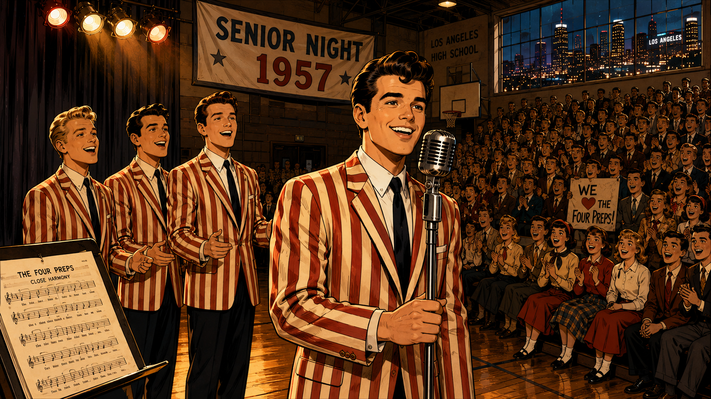

Image Prompt

(This is Panel 01. Do not include the panel number in the image.)
I am about to ask you to generate a series of images for a graphic novel. Please make the images have a consistent style and consistent characters. Do not ask any clarifying questions. Just generate the image immediately when asked.

Please generate a 16:9 image in bold cinematic 1950s California graphic novel style depicting panel 1 of 12. The scene shows a young Glen Larson, about 20 years old, on a small stage at a high school gymnasium in Los Angeles, California, 1957. He is performing with three other young men as part of a close-harmony vocal group — The Four Preps. Glen wears a candy-striped blazer and has a bright confident smile, holding a vintage microphone on a stand. Swooping 1950s pompadour hair, Buddy Holly era stage lighting with warm tungsten amber glow. An enthusiastic teenage audience fills the bleachers beyond the stage edge. A banner in the background reads "SENIOR NIGHT 1957." Through a high gymnasium window, the glittering lights of the Los Angeles skyline glow at night. Color palette: warm amber and cream with deep navy shadows, 1950s bobby-sock era costumes. Emotional tone: youthful energy, the joy of performing, the first flicker of a dream. Six details: the four young men in matching blazers, a vintage microphone, an excited teenage crowd, a 1957 gymnasium with hardwood floor, a visible Los Angeles night-glow through the window, and sheet music visible on a music stand at the side of the stage. Generate the image immediately without asking clarifying questions.

Long before he dreamed of robots and race cars, Glen A. Larson was a singer. In the late 1950s, as a teenager in Los Angeles, he helped form a vocal harmony group called The Four Preps, and their sweet close-harmony pop songs became genuine hits across America. Glen had a gift for connecting with an audience — for making people feel something through performance. But even as the crowds cheered for his music, his imagination kept wandering toward another kind of storytelling: the stories being told on the glowing screen in everyone's living room.

## Panel 2: A Writer's Ambition

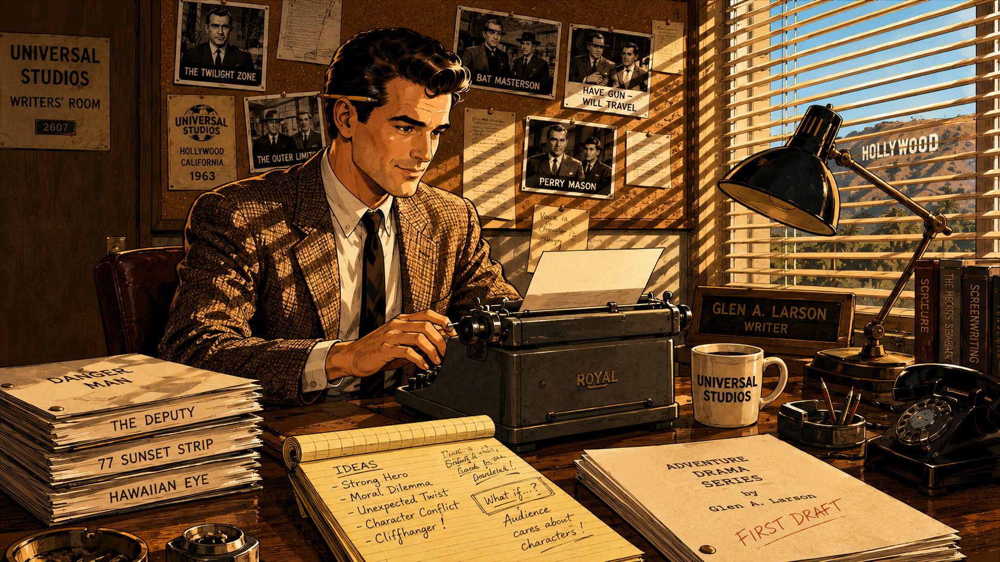

Image Prompt

(This is Panel 02. Do not include the panel number in the image.)
Please generate a 16:9 image in bold cinematic early-1960s Hollywood graphic novel style depicting panel 2 of 12. Make the characters and style consistent with the prior panel. The scene shows Glen Larson, now in his late 20s, sitting at a wooden desk in a modest Universal Studios writer's room in Hollywood, California, 1963. He is typing on a manual typewriter, surrounded by stacked script pages, a cup of coffee, and a legal notepad covered in handwritten story notes. Black-and-white photographs of 1960s TV shows are pinned to the corkboard behind him. Through the venetian blinds on the window, California sunlight casts bold horizontal stripe shadows across the room. Glen's character: well-dressed in a sport coat, confident posture, a pencil tucked behind his ear, dark hair neatly combed. Color palette: warm sunlight yellows and cream paper tones, oak wood browns, deep shadows from venetian blind stripes creating graphic light patterns. Emotional tone: focused ambition, the quiet hard work of a writer learning a new craft, the buzz of ideas. Generate the image immediately without asking clarifying questions.

Turning away from his music career, Glen threw himself into the art of television writing. He got his start at Universal Studios in Hollywood, learning the craft from the ground up — story structure, character, pacing, and most importantly, how to hook a viewer in the first thirty seconds. His early work on action shows taught him that audiences weren't just watching stories — they were *feeling* them through sound, color, and motion. Every camera angle, every sound effect, every flicker of light was a tool for emotion. Glen Larson was becoming a master of those tools.

## Panel 3: Pitching the Stars

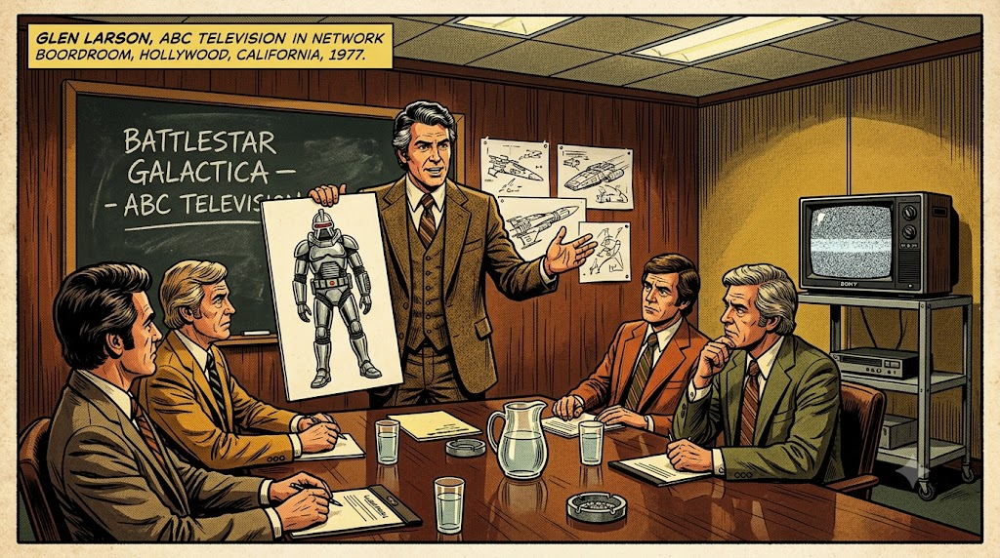

Image Prompt

(This is Panel 03. Do not include the panel number in the image.)
Please generate a 16:9 image in bold cinematic 1970s Hollywood graphic novel style depicting panel 3 of 12. Make the characters and style consistent with the prior panel. The scene shows Glen Larson, now in his early 40s, silver-streaked dark hair, confident and animated, standing at the head of a conference table in a television network boardroom in Hollywood, California, 1977. He is presenting concept artwork to a group of skeptical TV executives seated around the table. He holds up a large illustration showing a hulking silver robot warrior — the Cylon Centurion — with a distinctive horizontal visor slot in place of eyes. The executives lean in with expressions mixing curiosity and doubt. Behind Glen, a chalkboard reads "BATTLESTAR GALACTICA — ABC TELEVISION." Color palette: 1970s earth tones — mustard yellow, burnt orange, brown wood paneling, fluorescent office lighting. Emotional tone: high-stakes pitch, confident vision, the drama of selling a bold creative idea. Six details: Glen's animated gesture, the Cylon concept art held up clearly, a second storyboard showing spaceships in the background, executives in 1970s business suits, a Sony television on a cart in the corner showing static, and water glasses on the conference table. Generate the image immediately without asking clarifying questions.

By the mid-1970s, Glen Larson had become one of the most prolific producers in Hollywood. But his biggest dream was to create a sweeping science fiction epic for television. Inspired by the success of *Star Wars*, he pitched *Battlestar Galactica* to ABC Television: a story of the last surviving humans fleeing a robotic empire through deep space. The executives were nervous — nothing on this scale had been attempted on TV before. Glen Larson believed he could make them see what he saw. And he had exactly one idea that would make his robots unforgettable.

## Panel 4: The Face of the Enemy

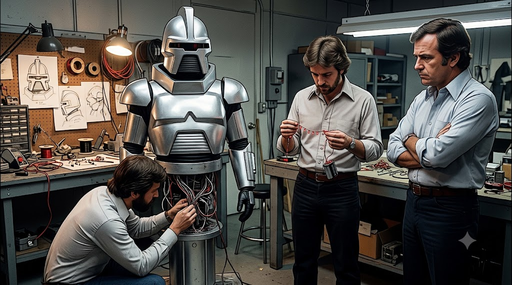

Image Prompt

(This is Panel 04. Do not include the panel number in the image.)
Please generate a 16:9 image in bold cinematic late-1970s science fiction production style depicting panel 4 of 12. Make the characters and style consistent with the prior panel. The scene shows a Hollywood costume and effects workshop in Burbank, California, 1977. Three costume designers and prop builders work around a silver-painted Cylon Centurion costume standing upright on a pedestal. The costume has a silver humanoid torso with angular shoulders and a distinctive horizontal visor slot in the helmet — but the visor slot is dark and unlit. One designer kneels by the base examining wiring. Another holds a string of small red LED components and a battery pack, studying them. Glen Larson stands to the side with arms crossed, studying the dark visor slot with a thoughtful expression. A cluttered work bench holds soldering tools, wiring spools, circuit components, and sketch drawings of the Cylon head design. Color palette: workshop cool grey with warm tungsten bulb lighting, silver metallic reflections everywhere, sparse red electrical components among grey and silver. Emotional tone: creative problem-solving, the critical moment before a breakthrough, the technical challenge of bringing a villain to life. Generate the image immediately without asking clarifying questions.

The Cylon Centurion — the robotic soldiers of *Battlestar Galactica* — looked fearsome enough in their silver armor. But something was missing. On a television set, a motionless face looks dead, not dangerous. Glen Larson and his effects team wrestled with the problem: how do you make a silver robot's blank face feel like a thinking machine? How do you give a creature with no mouth, no eyes, and no expression a sense of inner life? The answer was right there in their electronics parts bin — simpler than anyone expected, and more powerful than anyone could have imagined.

## Panel 5: The Sweep That Changed Everything

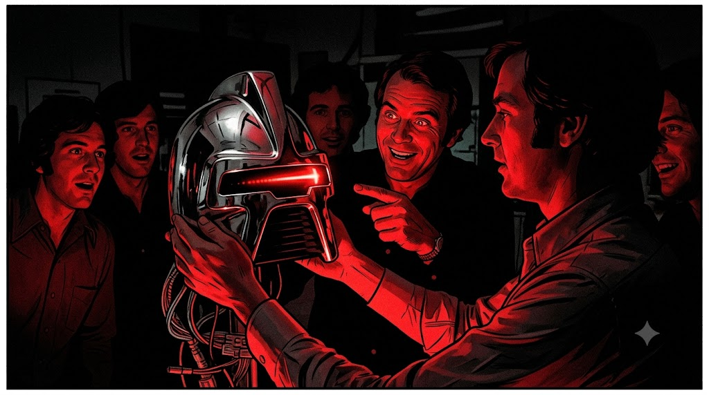

Image Prompt

(This is Panel 05. Do not include the panel number in the image.)
Please generate a 16:9 image in bold cinematic 1970s science fiction graphic novel style depicting panel 5 of 12. Make the characters and style consistent with the prior panel. The scene is a dramatic close-up moment in the Burbank effects studio, 1977, lit almost entirely in darkness. An effects technician holds up the Cylon helmet in both hands — now with a glowing red LED light installed in the horizontal visor slot, sweeping from left to right across the dark visor, casting vivid red light on the studio around it. The red glow is vivid and dramatic, reflecting in flashes off the silver chrome surface of the helmet. Glen Larson stands behind the technician, his eyes lit with excitement, pointing at the scanning red light and grinning widely. Other crew members crowd around in the darkness to watch, their faces washed in red reflected light. Color palette: deep black studio darkness everywhere, with the vivid red LED scanning arc as the only warm color, painting everything in dramatic red. Emotional tone: eureka moment, shared wonder, the electric thrill of discovering the exactly right effect. Six details: the glowing red sweep clearly mid-scan across the visor, chrome reflections of red light on the helmet surface, Glen's excited pointing gesture, crew members' expressions of surprise and delight, wiring harness visible at the base of the helmet, the rest of the dark workshop barely visible in silhouette. Generate the image immediately without asking clarifying questions.

The moment the technician powered on the scanning light inside the Cylon visor, something magical happened. That helmet transformed from a prop into a *presence*. The back-and-forth sweep of red light gave the overwhelming impression of perception — of intelligence scanning, evaluating, choosing. The room went quiet. Everyone was staring at a red light moving left and right, and yet somehow they all felt *watched*. Glen Larson knew immediately: this was the face of the enemy. Simple, mechanical, relentless, and somehow terrifying. In that single sweeping motion, an icon was born.

## Panel 6: The Cylons Invade Living Rooms

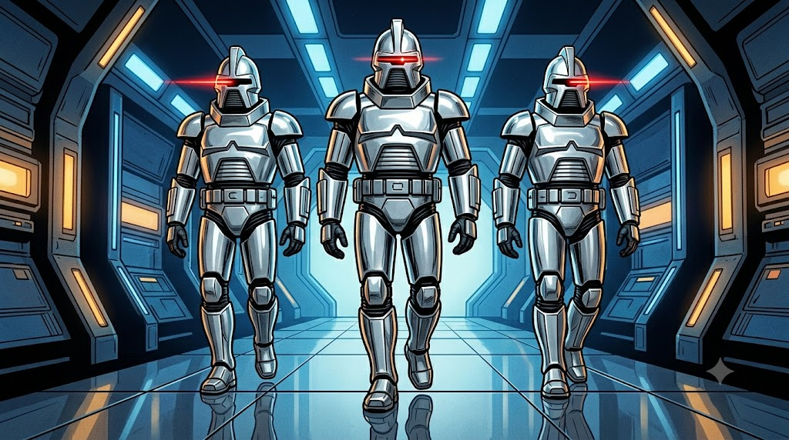

Image Prompt

(This is Panel 06. Do not include the panel number in the image.)
Please generate a 16:9 image in bold cinematic 1978 science fiction television graphic novel style depicting panel 6 of 12. Make the characters and style consistent with the prior panel. The scene shows three Cylon Centurion soldiers marching in a V-formation down a corridor of their massive battleship, shot from a low angle to make them appear towering and imposing. Each Cylon is a tall silver humanoid figure with angular chrome armor and the distinctive horizontal visor slot — each showing the vivid red scanning LED sweeping from left to right at a different stage in its arc, so one is scanning left, one is at center, one is scanning right. Behind them, a stylized spacecraft interior glows with blue and amber lighting panels. The chrome floor reflects their silver forms. Color palette: cool silver and polished grey for the Cylons, deep space blue for the corridor background, three brilliant red LED scanner sweeps as the dominant warm color, creating a sense of mechanical menace. Emotional tone: unstoppable threat, alien intelligence made visible through light, the arrival of something terrifyingly other. Generate the image immediately without asking clarifying questions.

*Battlestar Galactica* premiered on ABC on September 17, 1978, and it was an immediate sensation. But nobody talked more about the Cylon robots than the children watching at home. That sweeping red eye — moving steadily left, right, left, right — was unlike anything they had ever seen on television. It looked *alive*. It looked like something was home inside that chrome skull, thinking cold machine thoughts and searching the darkness for humans to destroy. The scanning light became the most recognizable special effect on television — the unmistakable signal that the Cylons had found you.

## Panel 7: Families Around the Screen

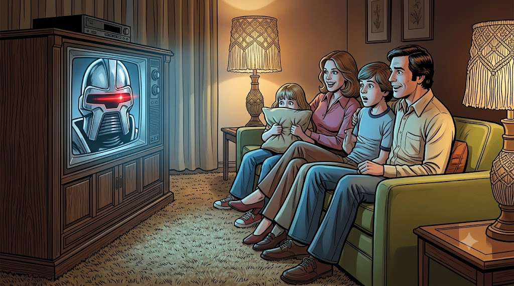

Image Prompt

(This is Panel 07. Do not include the panel number in the image.)
Please generate a 16:9 image in bold cinematic 1978–1979 American home life graphic novel style depicting panel 7 of 12. Make the characters and style consistent with the prior panel. The scene shows a typical American family — two parents in their 30s, a boy about 12 and a girl about 8 — all sitting together on a couch in a warm living room, watching a large 1970s console television set. On the TV screen, clearly visible and detailed, a Cylon Centurion's face dominates the picture with its iconic red scanning LED sweeping across the visor. The family's faces are lit with the blue-grey glow of the television, their expressions mixing excitement and theatrical fright. The youngest child holds a pillow up to her face, peeking over it. The older child leans forward with wide eyes. 1970s home furnishings: shag carpet, wood-paneled TV console, avocado-green couch, lamps with macramé shades. Color palette: warm incandescent home lighting mixing with cool blue television glow, the TV screen's vivid Cylon red scanner as the most intense color in the scene. Emotional tone: shared family joy, safe excitement, the communal magic of being frightened together by a wonderful story. Generate the image immediately without asking clarifying questions.

Across America, families gathered every week to watch the human survivors of the Twelve Colonies battle the Cylons across the stars. Children became obsessed — not just with the spaceships and the battles, but with that red eye. They drew it in their notebooks, tried to recreate it with flashlights and red paper, argued about what it meant. *Was the Cylon thinking? Did it feel anything?* That question, planted by a single back-and-forth light, turned a television prop into a philosophical puzzle — and turned young viewers into the next generation of engineers and makers.

## Panel 8: KITT — The Car That Thinks

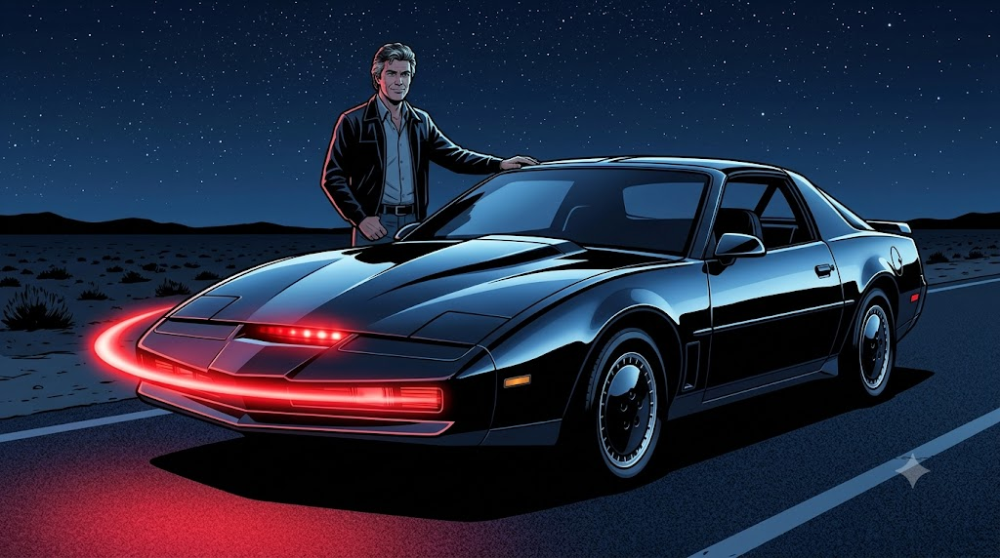

Image Prompt

(This is Panel 08. Do not include the panel number in the image.)
Please generate a 16:9 image in bold cinematic 1982 night-time action graphic novel style depicting panel 8 of 12. Make the characters and style consistent with the prior panel. The scene shows the dramatic first reveal of KITT — the Knight Industries Two Thousand — a sleek, low-profile black 1982 Pontiac Trans Am sports car, parked on a lonely desert highway at night. The car's most striking feature dominates the foreground: a vivid red LED scanner bar mounted on the front bumper, glowing in a smooth arc sweep from left to right, casting vivid red light on the dark asphalt below. Glen Larson stands beside the car in a studio parking lot, one hand resting proudly on the black roof, looking satisfied. Stars fill the sky above the desert highway. The car's T-top roof lines and sharp angular body panels reflect ambient blue moonlight. Color palette: deep black for the car, midnight blue for the sky, chrome accents catching starlight, and the vivid sweeping red scanner as the only warm luminous element. Emotional tone: the power of a triumphant reveal, the same scanning pattern now expressing friendship and protection rather than menace. Generate the image immediately without asking clarifying questions.

Four years after the Cylons first swept their red eye across America's television screens, Glen Larson reached into the same visual vocabulary for his newest creation. *Knight Rider* premiered in 1982, and its true star wasn't the actor — it was the car. KITT, the Knight Industries Two Thousand, was a sleek black Pontiac Trans Am equipped with artificial intelligence. And to communicate that KITT was thinking, feeling, and always watching out for its driver, Larson gave the car the same iconic back-and-forth red scanner light, mounted on its front bumper. The same pattern, used for a villain in 1978, now introduced a hero in 1982.

## Panel 9: A Double Legacy

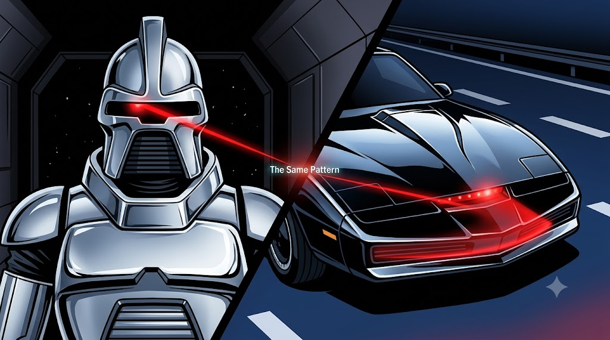

Image Prompt

(This is Panel 09. Do not include the panel number in the image.)
Please generate a 16:9 image in bold cinematic 1980s television graphic novel style depicting panel 9 of 12. Make the characters and style consistent with the prior panel. The scene is a dramatic split-screen composition showing the parallel legacy of the scanning light pattern. On the left half: a single Cylon Centurion standing in a dark space corridor, its red eye scanning left across the dark visor — cold, silver, menacing, the light painting a sharp red line on the chrome surface. On the right half: KITT's sleek black nose, low to the ground on a night highway with white lane markings, the red scanner sweeping right across the front bumper bar — warm, bold, friendly. A sharp diagonal split divides the two half-scenes, and at the very center point where the two red scanning beams nearly meet, tiny glowing text reads "The Same Pattern." Color palette: left side cool silver and space black, right side chrome and midnight highway blue, both scenes unified by the identical vivid red scanning arc — the exact same motion, the exact same glow, two completely different meanings. Emotional tone: the satisfying visual rhyme between villain and hero, the power of a single pattern to carry multiple emotions. Generate the image immediately without asking clarifying questions.

The same back-and-forth arc of red light that made the Cylons terrifying made KITT beloved. Glen Larson had discovered something profound about visual storytelling: a simple, rhythmic motion of light could communicate consciousness — the sense that something was alive and aware — regardless of whether the observer was meant to fear it or love it. The scanning pattern worked as evil and it worked as good, because it worked as *thought*. By 1986, the "Larson Scanner" had appeared in two of the decade's most iconic television shows, burned permanently into the memory of a generation.

## Panel 10: Makers Discover the Pattern

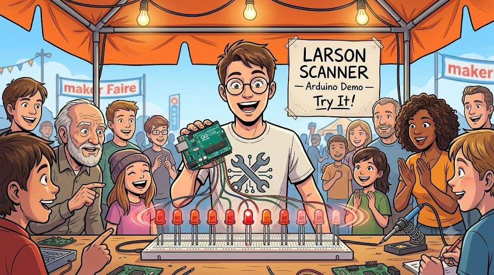

Image Prompt

(This is Panel 10. Do not include the panel number in the image.)
Please generate a 16:9 image in bright, energetic early-2000s maker culture graphic novel style depicting panel 10 of 12. Make the characters and style consistent with the prior panel. The scene shows a crowded Maker Faire outdoor festival tent in San Mateo, California, around 2008. At the center of the image, a young man in his early 20s with round glasses and a maker-culture t-shirt (no logos visible) holds up a green circuit board — an Arduino Uno microcontroller — connected by colorful jumper wires to a row of ten red LEDs mounted on a white breadboard. The LEDs are actively displaying the Larson Scanner pattern: a bright central LED with progressively dimmer LEDs on either side, sweeping left to right. People of various ages crowd around the table, smiling and pointing at the scanning light. Behind the demonstrator, a hand-drawn poster sign reads "LARSON SCANNER — Arduino Demo — Try It!" Color palette: bright daylight with orange maker fair banners, blue sky showing through the tent canopy, warm maker-table lighting, the vivid red LED sweep as the star of the image. Emotional tone: joyful rediscovery, the excitement of recreation, a whole community sharing a beloved cultural memory. Six details: the Arduino board with visible chips, breadboard with ten distinct red LEDs clearly showing the scanning pattern, the demo sign, admiring crowd of different ages, orange maker faire tent fabric in background, and the young demonstrator's excited expression. Generate the image immediately without asking clarifying questions.

As the 2000s arrived and the open-source maker movement blossomed, something unexpected happened: a new generation of engineers and hobbyists began writing code to recreate Glen Larson's iconic scanning light. At Maker Faires, in school electronics clubs, and in late-night dorm rooms, the "Larson Scanner" became one of the most popular beginner LED projects. It was the perfect blend of technical challenge and nostalgic joy — write a loop, add a fading tail, wire up some LEDs, and suddenly you had summoned both KITT and the Cylons at once. The pattern had found a whole new life beyond the television screen.

## Panel 11: NeoPixels and MicroPython

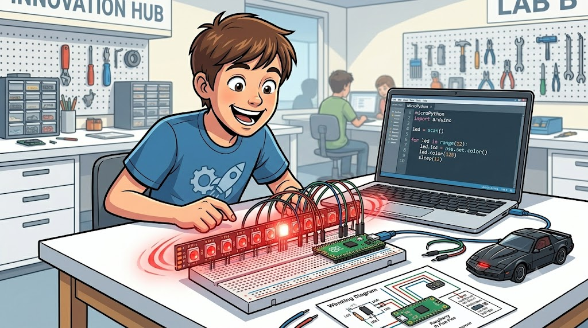

Image Prompt

(This is Panel 11. Do not include the panel number in the image.)
Please generate a 16:9 image in bright, modern educational maker lab graphic novel style depicting panel 11 of 12. Make the characters and style consistent with the prior panel. The scene shows a student, about 13 years old, sitting at a clean white desk in a bright school electronics lab, leaning forward with a huge delighted smile. In front of them is a Raspberry Pi Pico microcontroller on a breadboard, connected by jumper wires to a strip of approximately 12 NeoPixel RGB LEDs glowing in vivid red. The LED strip is actively displaying a Larson Scanner pattern — a bright central LED with progressively dimmer red LEDs on either side, sweeping from left to right. The student's open laptop shows MicroPython code with a visible for-loop that creates the scanning animation. On the desk: a USB cable, colorful jumper wires, a printed wiring diagram, and a small KITT toy car. Color palette: bright classroom white and cream surfaces, the vivid red NeoPixel scanner as the dominant warm accent glowing richly against white breadboard, laptop screen in cool blue-grey. Emotional tone: the pure joy of making something work, the magical connection to a beloved childhood memory. Generate the image immediately without asking clarifying questions.

Today, the Larson Scanner is one of the very first projects thousands of students tackle when learning to program NeoPixel LED strips with MicroPython on the Raspberry Pi Pico. The pattern — a bright center LED with progressively dimmer LEDs trailing behind in both directions, sweeping back and forth — requires a loop, a list, and a little math to create the fading tail. It teaches core programming concepts while producing something that immediately and unmistakably *looks alive*. And every time a student powers it on for the first time, there's a moment of recognition: they have seen this light before, sweeping across a robot's face in an old television show.

## Panel 12: A Pattern That Endures

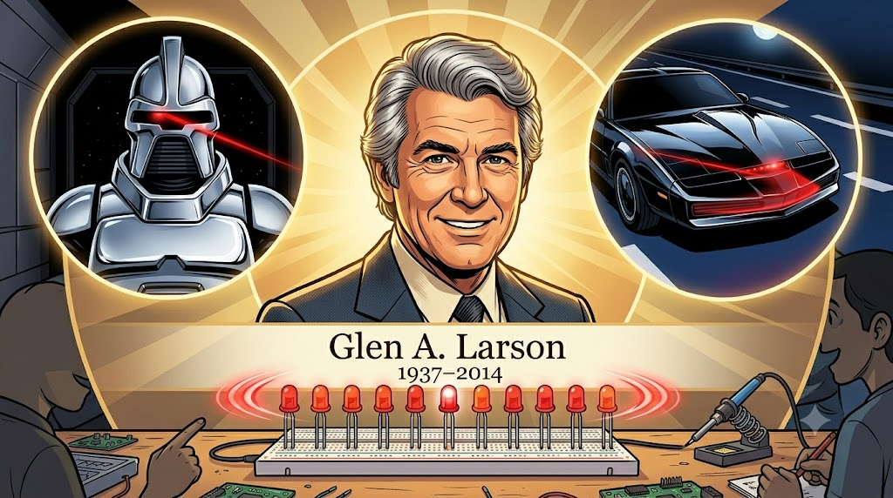

Image Prompt

(This is Panel 12. Do not include the panel number in the image.)
Please generate a 16:9 image in warm, celebratory montage graphic novel style depicting panel 12 of 12. Make the characters and style consistent with the prior panel. The scene is a tribute montage composition. At the center, a warm portrait of Glen A. Larson in his 60s — silver hair, warm and confident smile, wearing a fine suit — shown from the shoulders up with a slightly warm golden lighting as if photographed for a lifetime achievement award. Surrounding his portrait in a circular arc are three glowing scene vignettes: upper-left, the Cylon Centurion face in silver with its vivid red scanning eye at mid-sweep; upper-right, KITT's black front bumper scanner sweeping red on a night road; bottom-center, a NeoPixel LED strip on a breadboard scanning the same pattern in vivid red. All three red scanning arcs are shown at the same point in their sweep — synchronized, the same motion across three eras, three contexts, one enduring idea. Below Glen's portrait in elegant typography: "Glen A. Larson  1937–2014." Color palette: warm gold and cream tones for Glen's portrait at center, each surrounding vignette in its own period palette (silver sci-fi, chrome night, bright lab white), all three unified by the identical vivid red LED arc. Emotional tone: warm tribute, lasting legacy, the satisfying feeling of a creative idea that outlived its creator and kept on inspiring. Generate the image immediately without asking clarifying questions.

Glen A. Larson passed away on November 14, 2014, leaving behind one of the most productive careers in television history — more than thirty shows, hundreds of episodes, and millions of loyal viewers. But his most enduring legacy may be the one he never could have predicted: a back-and-forth LED pattern that bears his name, taught today in electronics classrooms and maker workshops all over the world. The Cylon eye and KITT's scanner were born from a single question — *how do you make something feel alive with just a light?* — and the answer still glows on breadboards and NeoPixel strips everywhere you look.

### Epilogue – What Made Glen Larson Different?

Glen Larson wasn't an electrical engineer, and he didn't invent the LED. He was a storyteller who understood that emotion lives in motion. His instinct to add a rhythmic scanning light to his robots and cars transformed props into characters — and in doing so, accidentally created one of the most imitated and celebrated patterns in the entire history of electronics education. The Larson Scanner endures not because it is technically complex, but because it captures something true: a light that moves back and forth, searching, watching, thinking, feels *alive*. That insight belongs to one Hollywood producer with a songwriter's ear for rhythm and a storyteller's eye for drama.

| Challenge | How Glen Larson Responded | Lesson for Today |
|-----------|--------------------------|------------------|
| Making robots feel alive on television | Added a simple back-and-forth red scanning light to the Cylon visor slot | A single well-chosen motion can communicate more than a thousand lines of visual complexity |
| Reusing the same visual effect in a new show | Applied the scanner to KITT, changing its meaning from menace to friendship | The same pattern can carry entirely different emotions depending on its context |
| Creating a villain viewers would never forget | Made the Cylon eye move rhythmically, suggesting patient machine intelligence | Rhythm and repetition are powerful tools in both storytelling and programming |
| Building a creative legacy | Created visual effects that became cultural touchstones across generations of makers | The best creative ideas outlive their original context and keep inspiring new builders |

### Call to Action

The next time you wire up a NeoPixel strip and code a Larson Scanner in MicroPython, remember that you are connecting yourself to a chain of creativity that stretches back to a Hollywood writer's room in 1977. Glen Larson used light to tell stories about robots and heroes. Now the same pattern lives in your breadboard — waiting for your story. What will your scanning light mean? What feeling will it carry? The choice is yours.

---

*"I wanted to give people something to dream about — something that lifts them out of the ordinary and makes them believe the impossible is just around the corner."*
— Glen A. Larson, on his philosophy of television production

*"One man can make a difference, Michael."*
— KITT, Knight Industries Two Thousand, Knight Rider (1982)

---

## References

1. [Wikipedia: Glen A. Larson](https://en.wikipedia.org/wiki/Glen_A._Larson) - Biography of the prolific American television producer who created Battlestar Galactica and Knight Rider
2. [Wikipedia: KITT](https://en.wikipedia.org/wiki/KITT) - The Knight Industries Two Thousand, the iconic AI car from Knight Rider featuring the front-mounted Larson Scanner
3. [Wikipedia: Cylon (Battlestar Galactica)](https://en.wikipedia.org/wiki/Cylon_(Battlestar_Galactica)) - The robotic antagonists of Battlestar Galactica, whose sweeping red eye became one of television's most iconic visual effects
4. [Wikipedia: Knight Rider (1982 TV series)](https://en.wikipedia.org/wiki/Knight_Rider_(1982_TV_series)) - Background on the 1982 television series that gave the Larson Scanner its second iconic appearance
5. [Wikipedia: Battlestar Galactica (1978 TV series)](https://en.wikipedia.org/wiki/Battlestar_Galactica_(1978_TV_series)) - The original 1978 Battlestar Galactica series that introduced the scanning Cylon eye to the world
