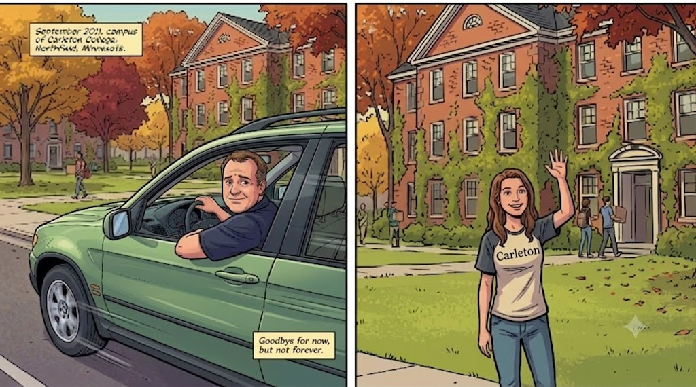
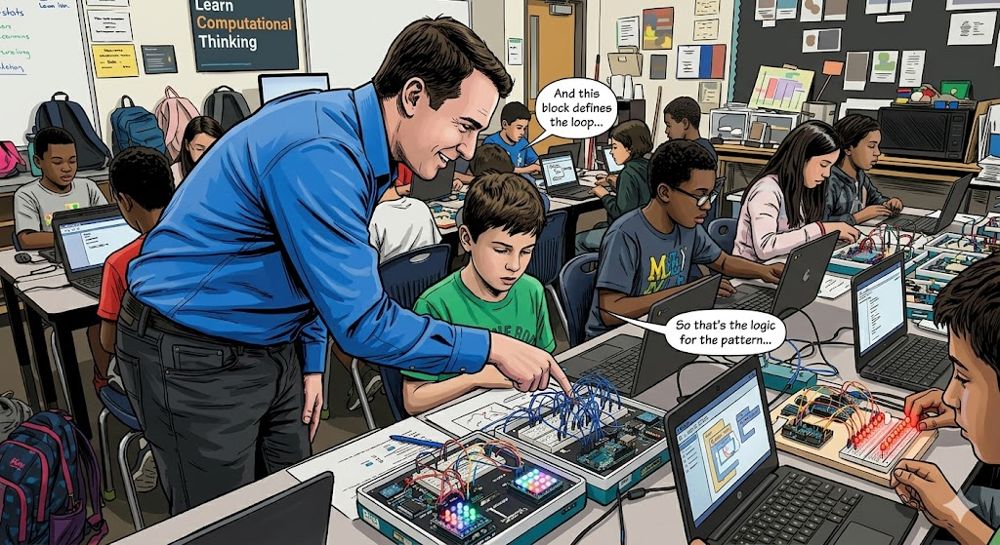
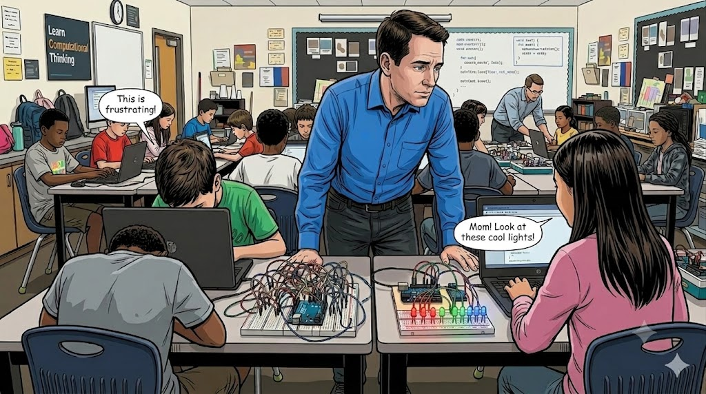
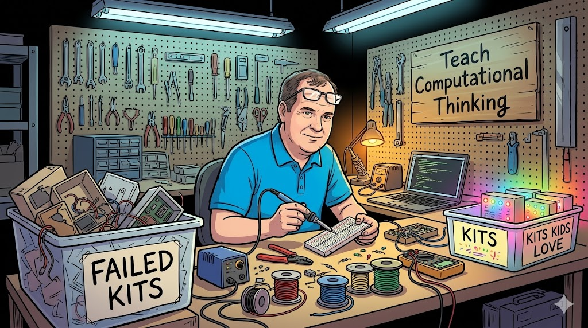
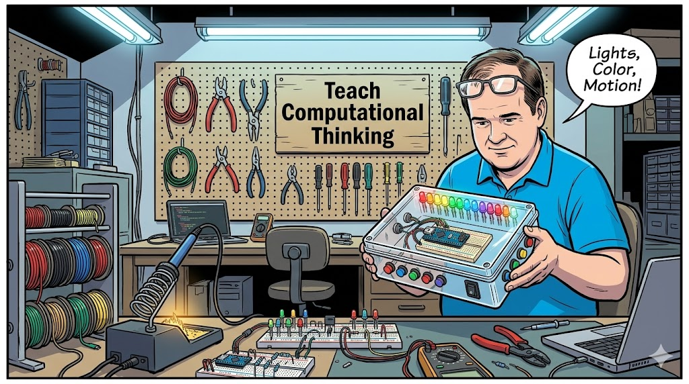
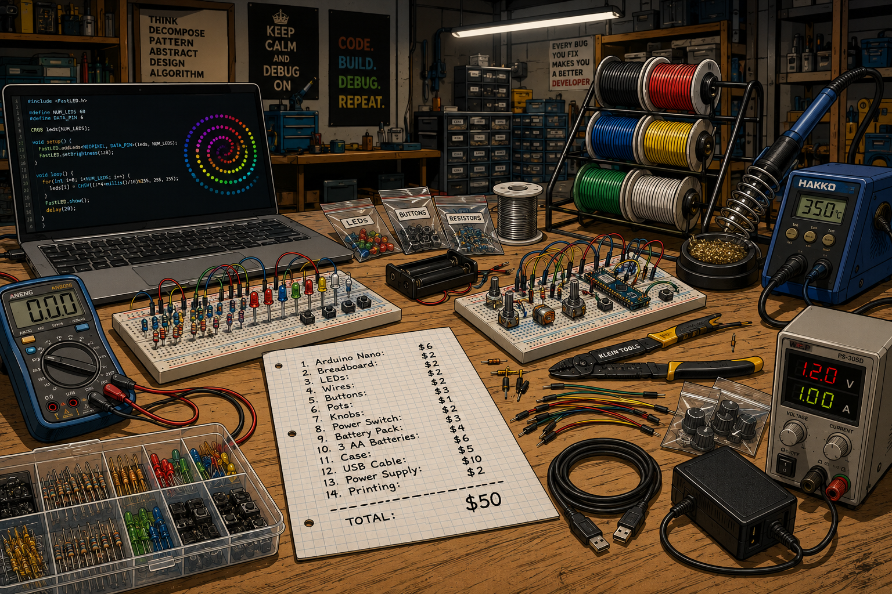
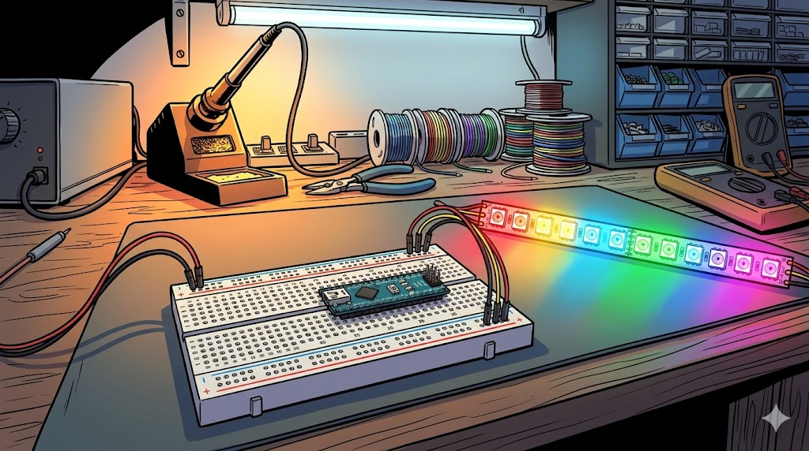
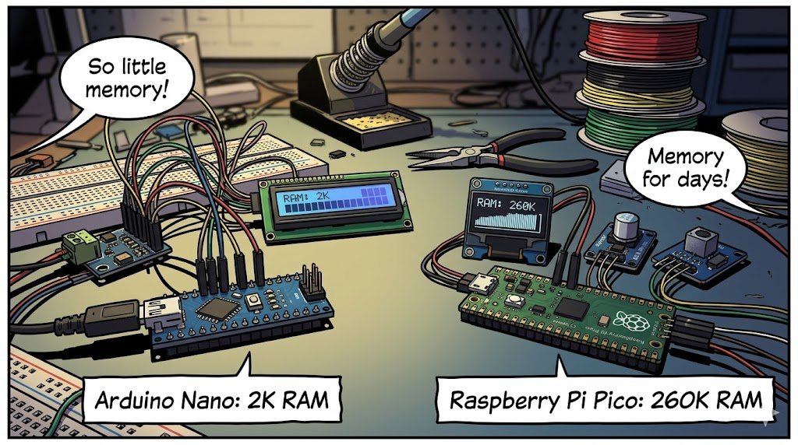
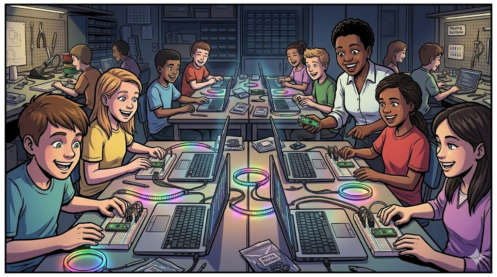
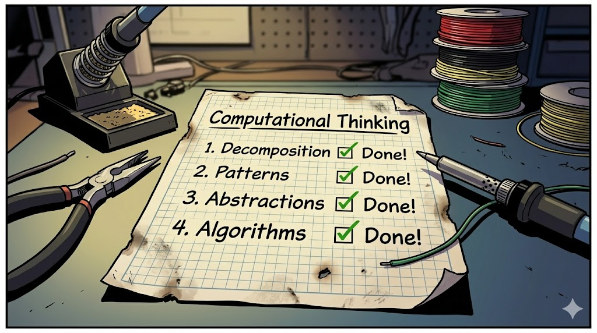

# The Story of the Moving Rainbow

When Dan McCreary's youngest daughter went off to college, Dan and his wife were "empty nesters".
As Dan dropped his daughter off at college 

## The Empty Nester

Dan Dropping Daughter Off at College

Create a new wide-format image for a graphic novel type story. 
Use a modern graphic novel with a bright colorful drawing style.

Subject: Dan McCreary, a white male in his mid-40s with short, slightly thinning brown hair, a round friendly face, brown eyes, clean-shaven, and a medium-to-stocky build. He is wearing a bright blue polo shirt.

Scene: September 2011, move-in day at Carleton College, Northfield, Minnesota. Dan is seated in the driver's seat of a SUV, window down, pulling away from a dormitory drop-off area. He is turned slightly, looking back over his left shoulder out the window. 
The SUV is a light green BMW X5.
His expression is bittersweet — a faint, forced half-smile masking visible emotion, eyes slightly glassy, brow furrowed with quiet sadness. The weight of the moment shows on his face.

Background: His college-age daughter stands on the sidewalk near the dorm entrance, smiling and waving goodbye. She has a warm, reassuring expression.

Campus Setting: Classic New England-style three-story red brick dormitory buildings covered in green ivy. Mature deciduous trees display peak autumn foliage in deep reds, burnt oranges, and golden yellows. A manicured green lawn stretches across a quiet, tree-lined campus in a small college town. Soft afternoon September light filters through the canopy.

Mood/Tone: Warm but emotionally bittersweet — a proud father quietly grieving the closing of an era of active parenthood, captured in a single glance back.

## Volunteering With Coding Clubs

With his daughter gone to college, Dan decided he loved working with kids.  So he began volunteering for coding clubs.  And boy did they need help!

Dan Helping Kids Learn to Code

Dan in a busy classroom teaching kids how to code.
He is wearing a bright blue shirt and black jeans.
A sign behind the students says "Learn Computational Thinking"
The kids are at laptops with Arduino kit in front of them.
One kit has a colorful red, green and blue LED lights.
One kit has a row of 10 red LEDs.
There are a lot of wires that need to be connected.
Dan is leaning over a student and pointing to a wire on a breadboard.

## Dan Sees Variability In Success

    
Dan Sees Variability In Success

    Generate a new graphic-novel wide-landscape drawing.
    An image of Dan carefully watching his students as he stands behind them
    in a busy coding club classroom.
    
    On the left side of the image we see a 12-year old male student that is frustrated.
    You only see the back of the laptop and a breadboard with LEDs and an Arduino Uno.
    There are many wires on the students breadboard but the LEDs are all dark.
    A speech bubble originates from the boy is "This is frustrating!"

    On the right Dan sees a 13-year old girl student that is really happy.
    You see the back of her laptop with bright red, green and blue LEDs.
    A speech bubble originates from her "Mom! Look at these cool lights!"

    Dan has an intense look of analysis on his face.

Dan is impressed how some kids really enjoy building and coding
the Arduino kits.  Other kids get frustrated.  In some projects there are too
many wires to hook up. Just one wire out of place can
keep a project from working.  Kids spend a lot of time
with wiring and then just copy and paste code.
Only a few students are patient enough to try
to change the code to create new patterns of lights.

## Dan Builds His Own Moving Rainbow Kits

    
Dan at His Workbench

    Please generate a new Wide-landscape drawing.
    Art Style: Wide-landscape graphic novel panel, bold ink outlines with flat cel-shaded color fills, high contrast, dramatic workshop lighting from overhead fluorescent tubes and warm soldering station glow. Style reminiscent of a technically-detailed indie graphic novel — clean linework, rich background detail, slightly cluttered but organized chaos.

Subject — Dan McCreary: A white male in his late 40s, medium-to-stocky build, short slightly-thinning brown hair, round friendly face, brown eyes, clean-shaven. He is seated on a shop stool at his workbench, leaning forward with focused concentration, wearing a casual bright blue polo shirt and reading glasses pushed up on his forehead. He holds a soldering iron in his right hand, a breadboard in his left, with a look of quiet determination.

Workbench (foreground): A cluttered but purposeful electronics bench with multiple breadboards populated with colorful resistors, LEDs, capacitors, and jumper wires. A professional soldering station with a coiled iron holder and brass tip cleaner. Spools of colored wire — red, black, blue, yellow, green — stacked in a wire rack. Scattered component bags, multimeter, wire strippers, and a laptop showing LED animation code.

Pegboard (background center): A large pegboard wall hung with organized tools — pliers, wire cutters, screwdrivers, hemostats — each outlined on the board in black marker. Centered prominently, a hand-painted wooden sign reading "Teach Computational Thinking" in bold stencil letters.

Left side — "Failed Kits" bin: A large clear plastic storage tub on a lower shelf, labeled "FAILED KITS" in bold black marker on white tape. Overflowing with project enclosures in various states of disarray — loose wires dangling out, cracked plastic cases, LED strips hanging over the edge, circuit boards half-inserted. Visually chaotic and slightly comical.

Right side — "Kits Kids Love" bin: A smaller clear plastic tub on the same shelf, labeled "KITS KIDS LOVE" in cheerful handwritten marker. Only a handful of neat project boxes inside, each glowing with rows of multicolored LED lights — warm reds, blues, greens — casting colorful light up through the clear plastic walls of the bin.

Lighting: Overhead cool fluorescent wash across the room, warm amber glow from the soldering station near Dan, and the soft multicolored LED glow from the "Kits Kids Love" bin casting rainbow light on the wall to the right.

Mood: Inventive, slightly obsessive, warmly nerdy — the workshop of a passionate educator who has failed dozens of times in pursuit of the one kit that makes a kid's eyes light up.

For several years Dan tried to build better project kits that were both fun
and would teach the core elements of Computational Thinking.

## Dan Builds Moving Rainbow 1.0

    
Dan Sees A Pattern

    Please generate a new Wide-landscape drawing.
    Art Style: Wide-landscape graphic novel panel, bold ink outlines with flat cel-shaded color fills, high contrast, dramatic workshop lighting from overhead fluorescent tubes and warm soldering station glow. Style reminiscent of a technically-detailed indie graphic novel — clean linework, rich background detail, slightly cluttered but organized chaos.

    Subject — Dan McCreary: A white male in his late 40s, medium-to-stocky build, short slightly-thinning brown hair, round friendly face, brown eyes, clean-shaven. He is seated on a shop stool at his workbench, leaning forward with focused concentration, wearing a casual bright blue polo shirt and reading glasses pushed up on his forehead.
    
    Dan is in his electronics workshop.
    Workbench (foreground): A cluttered but purposeful electronics bench with multiple breadboards populated with colorful resistors, LEDs, capacitors, and jumper wires. A professional soldering station with a coiled iron holder and brass tip cleaner. Spools of colored wire — red, black, blue, yellow, green — stacked in a wire rack. Scattered component bags, multimeter, wire strippers, and a laptop showing LED animation code.

    Pegboard (background center): A large pegboard wall hung with organized tools — pliers, wire cutters, screwdrivers, colored hookup wire — each outlined on the board in black marker. Centered prominently, a hand-painted wooden sign reading "Teach Computational Thinking" in bold stencil letters.

    Dan proudly holds a clear plastic project box with a row of 12 LEDs on the top.  There are buttons and knobs on the side of the box.  There is a power switch on the side at end.  Inside the box is a small blue microcontroller board (Arduino Nano) on a breadboard.

    A speech bubble above Dan says "Lights, Color, Motion!"

Dan observes that there are three key attributes of kits
    that students want to build.
    1. They have fun lights
    2. They have multiple colors
    3. They have motion (moving leds or motors)

After a year of building prototypes he finally has a prototype of his Moving Rainbow box version 1.0.
Now he can focus on teaching computational thinking while the kids have fun!

## The Accessibility Challenge

    
The Expensive Parts List

    Please generate a new Wide-landscape drawing.
    Art Style: Wide-landscape graphic novel panel, bold ink outlines with flat cel-shaded color fills, high contrast, dramatic workshop lighting from overhead fluorescent tubes and warm soldering station glow. Style reminiscent of a technically-detailed indie graphic novel — clean linework, rich background detail, slightly cluttered but organized chaos.

    Generate a image a list of parts on a workbench.
    Workbench (foreground): A cluttered but purposeful electronics bench with multiple breadboards populated with colorful resistors, LEDs, capacitors, and jumper wires. A professional soldering station with a coiled iron holder and brass tip cleaner. Spools of colored wire — red, black, blue, yellow, green — stacked in a wire rack. Scattered component bags, multimeter, wire strippers, and a laptop showing LED animation code.

    One the table is a piece of graph paper has a parts list:

    1. Arduino Nano: $6
    2. Breadboard: $2
    3. LEDs: $2
    4. Wires: $2
    5. Buttons: $2
    6. Pots: $3
    7. Knobs: $1
    8. Power Switch: $2
    9. Battery Pack: $3
    10. 3 AA Batteries: $4
    11. Case: $6
    12. USB Cable: $5
    13. Power Supply: $10
    14. Printing: $2
    -----------------
    TOTAL: $50

Do not put Dan in this image.

Although his students did love the Moving Rainbow project kit, there were two problems with his design.
First, Dan was not an expert at sourcing parts.  He purchased them in small quantities and so the
cost of the entire kit was almost $50.  The second problem was it took Dan many
hours to assemble the kits.  Each LED needed a resistor and the assembly process took a lot of time.
Dan needed to find a way to make the kits lower cost and easier to assemble.

## Panel 7: The NeoPixel Announced

    
The NeoPixel Strip

    Please generate a new Wide-landscape drawing.
    The aspect ratio is 16:9
    Art Style: Wide-landscape graphic novel panel, bold ink outlines with flat cel-shaded color fills, high contrast, dramatic close-up lighting. Style reminiscent of a technically-detailed indie graphic novel — clean linework, precise electronic component detail. Background is an electronics workshop bench, slightly blurred, showing a soldering iron, needle-nose pliers, and coiled spools of red, black, yellow, and green hookup wire.

Primary Subject — Breadboard and Nano (foreground, center):
A half-size 400-tie solderless breadboard in matte white/off-white with clearly rendered numbered columns (1–30) and lettered rows (a–e, f–j). The center gap/notch divides the board horizontally. Red and blue power rail strips run along both long outer edges.

An Arduino Nano sits straddling the center notch, mounted vertically with its USB Mini-B port facing upward at the top of the board. Its dual rows of pins insert cleanly into columns approximately 6–24, occupying rows e and f on each side of the gap. The Nano's black PCB, silver USB port, and small onboard components (voltage regulator, crystal, reset button) are rendered with technical graphic-novel precision.

Left Side — Power Rail Wires only (2 wires):

Red wire: a short bent wire running from the Nano's 5V pin (left header, inner tie point) horizontally and then down to the red (+) power rail on the left outer edge.
Black wire: a short bent wire running from the Nano's GND pin (left header, inner tie point) down to the blue (−) power rail on the left outer edge.
These two wires connect only to the power rails. No other wires touch the power rails.
Right Side — NeoPixel Data Wires (3 wires, do NOT touch power rails):
Three wires emerge from inner tie-point holes on the right half of the breadboard, directly from rows adjacent to the Nano's right header pins — they do not contact either power rail strip:

Red wire: from the tie point at Nano's 5V pin (right side row) → exits the breadboard rightward toward the NeoPixel strip's VCC pad.
Black wire: from the tie point at Nano's GND pin (right side row) → exits the breadboard rightward toward the NeoPixel strip's GND pad.
Yellow wire: from the tie point at Nano's D6 digital pin (right side row) → exits the breadboard rightward toward the NeoPixel strip's Data In pad.
All three wires run parallel, neatly to the right, and terminate at the solder pads of the LED strip. They are clearly mid-board connections, visually separated from the outer power rails.
NeoPixel LED Strip (right side, exiting frame):
A 12-pixel WS2812B NeoPixel strip oriented horizontally, each pixel lit in a distinct rainbow hue in sequence: red, orange, yellow, chartreuse, green, teal, cyan, sky blue, blue, indigo, violet, magenta/pink. The strip glows with soft colored light halos around each LED, casting subtle rainbow light onto the bench surface below.

Wiring Summary (explicitly NO extra wires):
Only five wires total exist in the drawing — 2 on the left (power rails), 3 on the right (to LED strip). The breadboard interior has no other jumper wires. The Nano's remaining pins are bare and unconnected.

Mood: Precise, instructional, and glowing — the aesthetic of an educational maker project rendered with graphic novel drama.

In 2013, Adafruit announced their newest product: the NeoPixel LED strip.
This strip was a huge innovation because although the strip only needed three wires (Ground, Power and Data)
every RGB LED could be individually controlled using 256 different brightness levels.
Dan hooked it up to his breadboard and quickly realized that this was going to make
his Moving Rainbow Kits much easier to setup so that students could have lights, color
and motion but spend more time on the code and less time making connections.

## Panel 8; From Nano to Pico

 Please generate a new Wide-landscape drawing.
    The aspect ratio is 16:9
    Art Style: Wide-landscape graphic novel panel, bold ink outlines with flat cel-shaded color fills, high contrast, dramatic close-up lighting. Style reminiscent of a technically-detailed indie graphic novel — clean linework, precise electronic component detail. Background is an electronics workshop bench, slightly blurred, showing a soldering iron, needle-nose pliers, and coiled spools of red, black, yellow, and green hookup wire.

    The image has a Arduino Nano on the left side (blue board) and a Raspberry Pi Pico on the Right.
    Under the Nano is the label "Arduino Nano: 2K RAM".  Under the Pico is the label "Raspberry Pi Pico: 260K RAM"

## Panel 9; Moving Rainbow In The Classroom

    
Classroom Full of Moving Rainbow Projects

        Please generate a new Wide-landscape drawing.
    The aspect ratio is 16:9
    Art Style: Wide-landscape graphic novel panel, bold ink outlines with flat cel-shaded color fills, high contrast, dramatic close-up lighting. Style reminiscent of a technically-detailed indie graphic novel — clean linework, precise electronic component detail. Background is an electronics workshop bench, slightly blurred, showing a soldering iron, needle-nose pliers, and coiled spools of red, black, yellow, and green hookup wire.

    Generate an graphic novel drawing of a classroom full of student working on the Moving Rainbow projects.
    The format of the classroom is a coding club where each student has their own laptop and a LED project next to their laptop.
    The LED project has a Raspberry Pi Pico microcontroller on a breadboard.  There are colorful LED strips and rings all over the desktops.
    The kids are all very happy.  They have big simles are some are laughing.
    The classroom instructor is a short black woman who is very happy.

## Panel 10: The Computational Thinking Checklist

Please generate a new Wide-landscape drawing.
The aspect ratio is 16:9

Art Style: Wide-landscape graphic novel panel, bold ink outlines with flat cel-shaded color fills, high contrast, dramatic close-up lighting. Style reminiscent of a technically-detailed indie graphic novel — clean linework, precise electronic component detail. 

Background is an electronics workshop bench, slightly blurred, showing a soldering iron, needle-nose pliers, and coiled spools of red, black, yellow, and green hookup wire.

On the electronics workshop bench is a old worn sheet of graph paper with a checklist.
The title at the top of the paper is "Computational Thinking".
The items under the title are the following items that are check off Done!:

1. Decomposition
2. Patterns
3. Abstractions
4. Algorithms

## Panel 8; The First Moving Rainbow Intelligent Book

The first online Moving Rainbow book was created in October of 2014.

