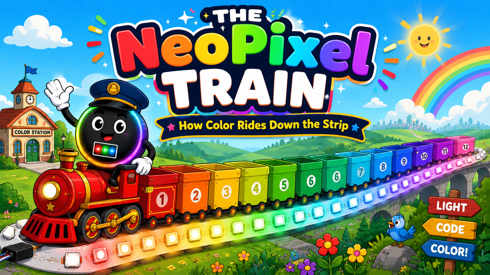

# The NeoPixel Train: How Color Rides Down the Strip

<!--  -->

Cover Image Prompt

(This is the Cover Image. Do not include this label in the image.)
Please generate a wide-landscape 16:9 cover image for a fun children's science graphic novel in a modern flat-vector cartoon style with bold clean outlines, bright saturated rainbow colors, soft cel-shading, and a friendly playful mood — like a polished kids' science animation. The scene shows a cheerful cartoon passenger train made of twelve open-top train cars, each car painted a different color of the rainbow in order from front to back: red, orange, yellow, yellow-green, green, teal-green, cyan, sky blue, blue, indigo, violet, and pink. The train rides on a glowing railroad track that is actually a flexible LED light strip, with small square LED chips spaced like stations along the rails. Standing on the front engine and waving is Pixel the conductor: a perfectly circular, matte charcoal-black character about the size of a beach ball, with a glowing rainbow halo ring around its body, a tiny white square window in the center of its body showing three mini glowing dots (one red, one green, one blue), large friendly cartoon eyes with bright reflections, thick expressive eyebrows, a wide warm smile, flexible cartoon arms ending in oversized white-glove hands, and a navy train conductor's cap with a shiny brim. Big bold bubbly title text at the top reads "THE NeoPixel TRAIN" and a smaller banner below reads "How Color Rides Down the Strip." Color palette: full rainbow spectrum against a soft sky-blue background with fluffy clouds, warm sunlight, and glowing LED light halos. Emotional tone: joyful, inviting, and adventurous. Generate the image immediately without asking clarifying questions.

Narrative Prompt

This is a fictional concept story for junior-high students (ages 11–14) that explains how an addressable LED strip (a NeoPixel / WS2812B strip) receives its color data, using the metaphor of a colorful train delivering passengers to stations down a track. The "train" is the stream of data the microcontroller sends out one wire. Each "train car" carries the color recipe for exactly one LED. Inside each car ride three passengers — Red, Green, and Blue — and each passenger carries 8 bits (a number from 0 to 255). When the train reaches an LED chip, the front car uncouples, its three passengers pour their 8 bits each into the chip's three tiny LEDs, the light turns on (POOF!), and the rest of the train continues down the track to the next LED. The story starts with a 12-car train and 12 dark LEDs and ends with a full rainbow of 12 glowing LEDs and an empty train.

Art style throughout: modern flat-vector cartoon style with bold clean outlines, bright saturated rainbow colors, soft cel-shading, and a friendly playful mood — like a polished children's science animation. Wide-landscape 16:9 composition.

Key recurring characters that must stay visually consistent across all panels:
- Pixel the Conductor: a perfectly circular, matte charcoal-black character about the size of a beach ball, with a glowing rainbow halo ring around its body, a tiny white square window in the center showing three mini glowing dots (red, green, blue), large friendly cartoon eyes with bright reflections, thick expressive eyebrows, a wide warm smile, flexible cartoon arms with oversized white-glove hands, sturdy legs in colorful rainbow-laced sneakers, and a navy conductor's cap with a shiny brim. Pixel sometimes carries a glowing lantern.
- The Red, Green, and Blue passengers: three small round glowing light-bulb characters — one bright red, one bright green, one bright blue — each with big friendly eyes, little arms, and a small suitcase stamped with eight binary digits (1s and 0s).
- The track is a glowing flexible LED light strip; the "stations" are evenly spaced small square LED chips, each with a tiny white square window showing three mini LED dies (red, green, blue).
- Avoid any real brand logos or trademarked product names in the artwork.

### Prologue – One Wire, Twelve Colors

Look at a NeoPixel strip lit up like a rainbow and you might wonder: *how does each tiny light know exactly which color to be?* There are twelve lights but only **one** little data wire feeding them. So how do twelve different colors travel down a single wire and end up in all the right places?

Here is the secret: the colors don't arrive all at once. They arrive **in a line**, like cars on a train — one color recipe after another, zooming down the track faster than you can blink. Climb aboard. Pixel the conductor is about to show you the most colorful railroad in all of electronics. *Let's light this up!*

## Panel 1: All Aboard at Code Station

<!--  -->

Image Prompt

(This is Panel 01. Do not include the panel number in the image.)
Please generate a 16:9 image in a modern flat-vector cartoon style with bold clean outlines, bright saturated colors, soft cel-shading, and a friendly playful mood — like a polished kids' science animation. This is panel 1 of 12. The scene is a sunny cartoon train station. A long passenger train made of twelve open-top cars waits at the platform, each car painted a different rainbow color in order from the engine back: red, orange, yellow, yellow-green, green, teal-green, cyan, sky blue, blue, indigo, violet, and pink. The station building is shaped like a small green microcontroller circuit board with two rows of shiny metal pins along its base and a hanging sign that reads "CODE STATION." Pixel the conductor — a perfectly circular matte charcoal-black character with a glowing rainbow halo ring, a tiny white center window showing three mini dots (red, green, blue), big friendly eyes, thick eyebrows, white-glove hands, and a navy conductor's cap — stands on the platform holding up a glowing lantern and a checklist. Behind the train, a long glowing LED light-strip railroad track stretches into the distance with twelve evenly spaced dark square LED-chip "stations" waiting along it. A bright departure board on the wall lists twelve colors in a row. Six details: the twelve rainbow-colored cars, the circuit-board station building, the "CODE STATION" sign, Pixel's lantern, the unlit LED-strip track, and the colorful departure board. Color palette: cheerful primary brights against a warm sunny sky. Emotional tone: anticipation and excitement before a big journey. Generate the image immediately without asking clarifying questions.

Every light show begins at **Code Station** — the place where your program lives. In the real world this station is a tiny computer called a **Raspberry Pi Pico**, and your MicroPython code is the stationmaster giving the orders. Today's order is simple but beautiful: *make twelve LEDs glow in twelve colors of the rainbow.*

Pixel checks the train one last time. Twelve cars, one for each LED. "One car, one light — that's the rule!" Pixel grins, tipping the conductor's cap. "Twelve lights to wake up, twelve colors to deliver. Coders, are you ready? **Let's light this up!**"

## Panel 2: Meet the Passengers

<!--  -->

Image Prompt

(This is Panel 02. Do not include the panel number in the image.)
Please generate a 16:9 image in the same modern flat-vector cartoon style, consistent with the previous panel. This is panel 2 of 12. The scene is a friendly cutaway cross-section view of the inside of a single bright-red train car, like looking into a dollhouse. Inside sit three small round glowing light-bulb passenger characters side by side on a bench: one bright red, one bright green, and one bright blue, each with big friendly cartoon eyes, little arms, and a happy expression. Each passenger holds a small suitcase on their lap, and each suitcase is stamped with a row of eight binary digits (ones and zeros, like "11111111" or "00000000"). A small overhead sign inside the car reads "ONE CAR = ONE PIXEL." Pixel the conductor — the charcoal-black circular character with the rainbow halo ring and navy conductor's cap — leans into the open side of the car, smiling and gesturing toward the three passengers. Six details: the three colored bulb passengers, their three labeled 8-digit suitcases, the bench seat, the "ONE CAR = ONE PIXEL" sign, the cutaway dollhouse view, and Pixel leaning in. Color palette: warm interior light with vivid red, green, and blue character colors. Emotional tone: warm and introductory, like meeting new friends. Generate the image immediately without asking clarifying questions.

Pixel pops open the side of the first car so we can peek inside. "Meet your travel crew!" Three cheerful little characters wave back: **Red**, **Green**, and **Blue**. Every single car carries the same trio — they're the team that mixes *every* color you've ever seen on a screen.

"Each car holds the complete recipe for one light," Pixel explains. "Want a deep purple? A sunny yellow? A spooky teal? You just tell Red, Green, and Blue how bright to shine, and together they mix it. They never travel apart — Red, Green, and Blue are a forever team."

## Panel 3: The 8-Bit Suitcases

<!--  -->

Image Prompt

(This is Panel 03. Do not include the panel number in the image.)
Please generate a 16:9 image in the same modern flat-vector cartoon style, consistent with the previous panels. This is panel 3 of 12. The scene is a close-up of the three passengers — Red, Green, and Blue light-bulb characters — proudly opening their suitcases to show what's inside. Each open suitcase reveals a neat row of eight tiny toggle switches, like little light switches, some flipped ON (glowing) and some flipped OFF (dark), representing 8 bits. Above each suitcase floats a friendly number label showing the value: Red's suitcase shows all eight switches ON labeled "255 = FULL BRIGHT", Green's suitcase shows all switches OFF labeled "0 = OFF", and Blue's suitcase shows all switches OFF labeled "0 = OFF". A big cheerful banner across the top reads "8 BITS = A NUMBER FROM 0 TO 255." Pixel the conductor points upward at the banner with a sparkle effect near a white-glove fingertip. Six details: three open suitcases with eight toggle switches each, the glowing-vs-dark switch states, the floating number labels, the "0 to 255" banner, the sparkle by Pixel's finger, and the three colored characters. Color palette: bright red, green, and blue with clean white switch panels. Emotional tone: an exciting "aha!" learning moment. Generate the image immediately without asking clarifying questions.

"Now, what's *in* those suitcases?" Pixel taps one. "**Bits!** Eight little switches, each one ON or OFF. Flip them in different combinations and you spell out a number — anywhere from **0** (all switches off) to **255** (all switches on)."

So Red's number is how bright the red part glows, Green's number is how bright the green part glows, and Blue's number is how bright the blue part glows. Three numbers, three suitcases, one color. Right now Red is carrying **255** and Green and Blue are carrying **0** — that recipe `(255, 0, 0)` means *full-power red!* This car is going to make its light glow pure red.

## Panel 4: Departure!

<!--  -->

Image Prompt

(This is Panel 04. Do not include the panel number in the image.)
Please generate a 16:9 image in the same modern flat-vector cartoon style, consistent with the previous panels. This is panel 4 of 12. The scene is the dramatic moment of departure. Pixel the conductor stands on the front engine, one white-glove hand raised, blowing a train whistle that puffs a cheerful cloud of steam. The full twelve-car rainbow train (red engine-end car to pink rear car) is pulling out of the green circuit-board "CODE STATION" and onto a single glowing LED light-strip railroad track that stretches far into the distance. The track glows with a pulse of energy like data flowing, shown as small bright light-dashes traveling along the rail. A motion-blur effect and speed lines show the train accelerating. A floating speech bubble from Pixel reads "ALL ABOARD! ONE WIRE, ONE CAR AT A TIME!" In the distance, twelve dark square LED-chip stations wait along the glowing track. Six details: Pixel blowing the whistle with steam, the twelve rainbow cars in motion, the single glowing data-track rail with traveling light-dashes, speed lines and motion blur, the speech bubble, and the row of distant dark LED stations. Color palette: vivid rainbow train against an energetic glowing-blue data track. Emotional tone: thrilling lift-off energy. Generate the image immediately without asking clarifying questions.

**TOOT-TOOT!** Pixel blows the whistle and the train rolls out of Code Station onto the data track — the single skinny wire that connects the Pico to the LED strip.

"Here's the wild part," Pixel calls over the rumble. "All twelve cars have to share **one** track, so they travel in a line — one car's worth of bits, then the next, then the next. It looks impossible, but watch the speed!" The whole train of color recipes streams down the wire in less time than it takes to say "rainbow." Coders call this a **data signal**. Pixel just calls it *showtime*.

## Panel 5: First Stop — Pixel #0

<!--  -->

Image Prompt

(This is Panel 05. Do not include the panel number in the image.)
Please generate a 16:9 image in the same modern flat-vector cartoon style, consistent with the previous panels. This is panel 5 of 12. The scene shows the rainbow train arriving at the very first station along the glowing LED-strip track. The first station is a friendly-looking small square LED chip with a tiny white square window in its center showing three dark mini LED dies (red, green, blue) waiting to be lit. The front car of the train — the bright RED car — is uncoupling and rolling to a gentle stop right at this first chip station, while the remaining eleven colored cars wait just behind it on the track. A cheerful platform sign at this station reads "STOP 1 — PIXEL 0." Pixel the conductor leans out from the side of the red car, pointing helpfully at the waiting LED chip. A small floating caption bubble reads "Coders count starting at ZERO!" Six details: the square LED-chip station with its dark three-die window, the red front car stopping, the eleven waiting cars behind, the "STOP 1 — PIXEL 0" sign, Pixel pointing, and the "count from zero" caption. Color palette: bright red car against a still-dark first LED chip, rainbow cars waiting behind. Emotional tone: arrival and gentle suspense before the first light. Generate the image immediately without asking clarifying questions.

The train reaches the **first LED chip** on the strip, and the front car — our full-power red car — gently uncouples and stops right at the station. The other eleven cars wait patiently on the track behind it.

"Quick coder secret," Pixel whispers with a wink. "We count LEDs starting at **zero**, not one. So this first light is *Pixel 0*, then Pixel 1, Pixel 2, all the way up. It feels weird at first, but you'll get used to it — in your code you'll write `np[0]` to talk to this very first light." The little LED chip waits, dark and ready. Its job is about to begin.

## Panel 6: Loading the Bits — POOF!

<!--  -->

Image Prompt

(This is Panel 06. Do not include the panel number in the image.)
Please generate a 16:9 image in the same modern flat-vector cartoon style, consistent with the previous panels. This is panel 6 of 12. The scene is an energetic action moment: the three passengers — Red, Green, and Blue light-bulb characters — have hopped out of the stopped red train car and are pouring the bits from their suitcases into three matching slots on the LED chip. Inside the chip's white square center window are three tiny LED dies labeled R, G, and B; Red empties a stream of glowing "1" bits into the R slot, while Green and Blue tip their suitcases of "0" bits into the G and B slots. A big bright comic-style burst with the word "POOF!" erupts as the LED chip blazes to life in pure brilliant RED, casting a red glow halo all around it. The now-empty red train car sits beside the chip. Pixel the conductor cheers with both white-glove hands raised. Six details: the three passengers pouring bits, the labeled R/G/B slots on the chip, the "POOF!" comic burst, the LED chip glowing bright red with a light halo, the emptied train car, and Pixel cheering. Color palette: explosive bright red glow with vivid character colors. Emotional tone: triumphant, the joyful payoff of the first light turning on. Generate the image immediately without asking clarifying questions.

Red, Green, and Blue hop out and get to work. Red pours **255** worth of bits into the chip's red slot. Green tips in **0**. Blue tips in **0**. The little chip drinks up all twenty-four bits...

**POOF!** Pixel 0 blazes to life in brilliant, glowing red — the very first light of the rainbow! "WOO-HOO!" Pixel punches the air. "One down! See that? The bits left the suitcases and became *actual light*. That's the whole magic trick — numbers in, color out." The passengers dust off their empty suitcases and the job at this station is done.

## Panel 7: Pass It Down the Line

<!--  -->

Image Prompt

(This is Panel 07. Do not include the panel number in the image.)
Please generate a 16:9 image in the same modern flat-vector cartoon style, consistent with the previous panels. This is panel 7 of 12. The scene illustrates the key "pass it on" idea. On the left, the first LED chip station now glows steady bright red and an emptied red train car sits parked beside it, finished. The rest of the train — now eleven colored cars (orange at the front, then yellow, yellow-green, green, and so on back to pink) — is rolling onward to the right along the glowing LED-strip track toward the next dark LED chip station. A big friendly curved arrow labeled "PASS THE REST ALONG" sweeps from the red station to the next station. Pixel the conductor rides on top of the new front car (orange), pointing forward down the track. A small caption reads "Each light keeps its own car, then sends the rest on." Six details: the finished red glowing chip with its parked empty car, the eleven remaining rainbow cars in motion, the next dark LED chip ahead, the big "PASS THE REST ALONG" arrow, Pixel riding the orange car, and the caption. Color palette: one glowing red light on the left, a rainbow train heading toward darkness on the right. Emotional tone: clever and satisfying, like understanding a smart system. Generate the image immediately without asking clarifying questions.

Here's the cleverest part of the whole railroad. Each LED chip **keeps the one car meant for it** — and then **passes every other car straight down the line** to the next chip. The first light grabbed the red car and shoved the remaining eleven cars onward toward Pixel 1.

"That's the genius of it!" Pixel says, hopping onto the new front car. "No light needs to know about the whole rainbow. Each one just thinks: *Is the front car mine? Yes? I'll take it. The rest? Not my business — pass it on!* Eleven cars to go, coders. Next stop!"

## Panel 8: The Rainbow Builds

<!--  -->

Image Prompt

(This is Panel 08. Do not include the panel number in the image.)
Please generate a 16:9 image in the same modern flat-vector cartoon style, consistent with the previous panels. This is panel 8 of 12. The scene is an energetic montage showing the train getting shorter as it delivers cars down the line. Along the glowing LED-strip track from left to right, the first five LED chip stations are now lit and glowing in order: red, orange, yellow, yellow-green, and green, each with a colorful light halo, and each with a small emptied train car parked beside it. A shorter train of seven remaining cars (teal-green at the front through pink at the back) continues rolling to the right toward the still-dark chips. Pixel the conductor rides along, beaming with joy, rainbow halo ring glowing brighter than before. Little "POOF!" sparkle bursts pop above the most recently lit green chip. Six details: five glowing LED chips in a rainbow row (red, orange, yellow, yellow-green, green), five parked empty cars, the shorter seven-car train still moving, a fresh "POOF!" sparkle over the green chip, Pixel's brightened rainbow ring, and the dark chips waiting ahead. Color palette: a growing rainbow gradient of glowing lights on the left, fading to dark on the right. Emotional tone: building momentum and delight. Generate the image immediately without asking clarifying questions.

Now the train really finds its rhythm. **POOF — orange!** at Pixel 1. **POOF — yellow!** at Pixel 2. **POOF — yellow-green!** at Pixel 3. **POOF — green!** at Pixel 4. One after another, each car drops off its trio, the bits flow in, and a new color blinks awake.

Pixel's rainbow ring glows brighter with every stop — that's how you know Pixel is *excited*. "Look behind us!" they laugh. "We're painting a rainbow one light at a time, and the train keeps getting lighter. Seven cars left. Keep rolling!"

## Panel 9: Halfway and Glowing

<!--  -->

Image Prompt

(This is Panel 09. Do not include the panel number in the image.)
Please generate a 16:9 image in the same modern flat-vector cartoon style, consistent with the previous panels. This is panel 9 of 12. The scene shows the journey well past the halfway point. Along the glowing LED-strip track, the first eight LED chips are now lit in a smooth rainbow sequence from left to right: red, orange, yellow, yellow-green, green, teal-green, cyan, and sky blue, each glowing with a colored halo and each with a tiny emptied car parked beside it. Only a short train of four cars remains — blue at the front, then indigo, violet, and pink — rolling toward the final dark chips on the right. Pixel the conductor stands tall on the front blue car, one white-glove hand shielding their eyes, looking ahead toward the last few stations. A small floating cheer reads "Almost there, light-makers!" Six details: eight glowing rainbow LED chips in order, eight parked empty cars, the short four-car train, Pixel looking ahead from the blue car, the "Almost there" cheer, and the last dark chips on the right. Color palette: a long glowing rainbow on the left transitioning to cool blues, with darkness only at the far right. Emotional tone: encouraging and nearly-there. Generate the image immediately without asking clarifying questions.

The strip is more than half rainbow now. **Teal-green** wakes up at Pixel 5, **cyan** at Pixel 6, **sky blue** at Pixel 7. The train is down to just four cars — blue, indigo, violet, and pink — rolling toward the cool end of the rainbow.

"Almost there, light-makers!" Pixel shouts, shading their eyes to peer down the track. "Notice how *fast* this is going? In real life, this entire trip — all twelve stops — finishes in less than a thousandth of a second. Our eyes can't even see the cars move. We just see the rainbow appear, like magic. But *you* know the secret now: it's not magic, it's a train!"

## Panel 10: The Last Cars

<!--  -->

Image Prompt

(This is Panel 10. Do not include the panel number in the image.)
Please generate a 16:9 image in the same modern flat-vector cartoon style, consistent with the previous panels. This is panel 10 of 12. The scene focuses on the final stretch. Along the glowing track, eleven LED chips are now lit in a near-complete rainbow from left to right: red, orange, yellow, yellow-green, green, teal-green, cyan, sky blue, blue, indigo, and violet, each glowing with a colored halo, each beside a parked empty car. Only ONE train car remains on the track — the bright PINK car — rolling toward the very last dark LED chip on the far right, whose station sign reads "STOP 12 — PIXEL 11." Inside the pink car, the three passengers Red, Green, and Blue lean out the window, waving and ready, suitcases in hand. Pixel the conductor rides on the pink car, holding the glowing lantern high. Six details: eleven glowing rainbow chips with parked cars, the single pink car in motion, the three waving passengers in the window, the "STOP 12 — PIXEL 11" sign, the last dark chip, and Pixel holding the lantern high. Color palette: an almost-complete glowing rainbow with one small gap of darkness at the far right. Emotional tone: building toward a grand finale. Generate the image immediately without asking clarifying questions.

**Blue. Indigo. Violet.** Pixels 8, 9, and 10 flicker to life. And now... just one car is left. The bright **pink** car rolls toward the final stop, with Red, Green, and Blue leaning out the window, suitcases packed and ready.

"Last car, coders! This is it!" Pixel raises the lantern high. The station sign reads **STOP 12 — PIXEL 11**. (Remember the coder secret? We started counting at zero, so the *twelfth* light is named *Pixel 11*. Twelve lights, numbered 0 through 11 — that's how programmers do it.) The whole strip holds its breath, one dark light away from a complete rainbow.

## Panel 11: The Final POOF — Pixel 11

<!--  -->

Image Prompt

(This is Panel 11. Do not include the panel number in the image.)
Please generate a 16:9 image in the same modern flat-vector cartoon style, consistent with the previous panels. This is panel 11 of 12. The scene is the grand finale moment. At the very last LED chip on the far right of the track, the three passengers Red, Green, and Blue pour the final suitcases of bits into the chip's R, G, and B slots, and a huge bright comic-style "POOF!" burst erupts as the twelfth and last LED blazes to life in glowing PINK. Now the ENTIRE LED-strip track glows in a complete, smooth twelve-color rainbow from left to right: red, orange, yellow, yellow-green, green, teal-green, cyan, sky blue, blue, indigo, violet, and pink, each casting a colorful light halo, the whole strip radiant with light. Pixel the conductor leaps into the air in pure joy above the glowing strip, rainbow halo ring blazing at full brightness, both white-glove hands thrown up, conductor's cap flying. Confetti and sparkles fill the air. Six details: the final "POOF!" on the last pink chip, the complete twelve-color glowing rainbow strip, the light halos along the whole strip, Pixel leaping with full rainbow ring, the flying conductor cap, and confetti sparkles. Color palette: a dazzling full-spectrum rainbow at maximum glow. Emotional tone: triumphant celebration, the big payoff. Generate the image immediately without asking clarifying questions.

Red pours. Green pours. Blue pours. The last twenty-four bits tumble into the final chip and —

**POOF!** Pixel 11 lights up in glowing pink, and the *entire strip* erupts into a complete, glorious twelve-color rainbow! Red, orange, yellow, green, blue, violet, pink — every single light exactly where it belongs.

Pixel leaps into the air, rainbow ring blazing at full power, cap flying. "**WE DID IT!** Twelve cars, twelve colors, twelve lights — every bit delivered to exactly the right place! *That's* how a NeoPixel strip thinks, coders. Give yourselves a glow!"

## Panel 12: The Empty Train Heads Home

<!--  -->

Image Prompt

(This is Panel 12. Do not include the panel number in the image.)
Please generate a 16:9 image in the same modern flat-vector cartoon style, consistent with the previous panels. This is panel 12 of 12. The scene is a warm, satisfying wrap-up. In the foreground, the now completely EMPTY train — twelve open, passenger-free cars with their suitcases delivered — rolls gently back toward the green circuit-board "CODE STATION" on the left, ready for the next trip. In the background, the full LED-strip track glows in a complete, beautiful twelve-color rainbow (red through pink), lighting the whole scene with colorful light. Pixel the conductor rides on the front of the empty train, relaxed and happy, giving a friendly wave and a big thumbs-up to the viewer, rainbow halo ring glowing warmly. A banner across the top reads "THE TRAIN IS EMPTY — EVERY PIXEL HAS ITS COLOR!" A small sign near the station reads "READY FOR THE NEXT TRIP." Six details: the empty twelve-car train returning, the glowing full-rainbow LED strip in the background, the green circuit-board station, Pixel waving with a thumbs-up, the "TRAIN IS EMPTY" banner, and the "READY FOR THE NEXT TRIP" sign. Color palette: warm sunset glow over a complete rainbow strip. Emotional tone: contented, accomplished, and ready for more. Generate the image immediately without asking clarifying questions.

The train rolls home to Code Station, every car empty, every suitcase delivered, every light glowing. Mission complete!

"And here's the best part," Pixel says with a wink. "When you want the rainbow to *move* — to shimmer and chase and dance — you just send a brand-new train! New colors in the cars, off they go, and the whole strip changes in the blink of an eye. Do it thirty times a second and your lights come alive. Every animation you'll ever code is really just train after train after train, rolling down the same little wire." Pixel tips the cap one last time. "You're already glowing — now go make *your* LEDs glow too!"

## Epilogue: What the Train Taught Us

| The Question | What the Train Showed Us | The Real Idea |
|---|---|---|
| How do twelve colors fit on one wire? | The cars travel in a single line, one after another | Data is **serial** — it streams down one data line in order |
| How does each light know its color? | Each car carries one light's recipe: Red, Green, Blue | Every pixel needs **24 bits** — 8 for red, 8 for green, 8 for blue |
| What is a "bit," really? | Eight switches in a suitcase spelling a number 0–255 | **8 bits** make one **byte**, a value from 0 to 255 |
| How does a light grab the *right* recipe? | Each chip keeps its own car and passes the rest along | The strip works like a **shift register** — take one, forward the rest |
| Why is it called Pixel 0? | Coders count starting at zero | Strips are **zero-indexed**: `np[0]` to `np[11]` for 12 lights |
| How does the rainbow seem to appear instantly? | The whole train finishes in under a thousandth of a second | Data travels **incredibly fast** — faster than your eye can follow |

## Pixel's Glow-Notes

> *"One car, one light — that's the rule! Twelve lights to wake up, twelve colors to deliver."*

> *"The bits left the suitcases and became actual light. That's the whole magic trick — numbers in, color out."*

> *"Every animation you'll ever code is really just train after train after train, rolling down the same little wire."*

## Your Turn, Light-Maker

Pixel just walked you through the secret life of a single data wire — but the real fun starts when **you** drive the train. Next time you type `np[0] = (255, 0, 0)` and watch a light snap to red, picture it: a little car pulling up to a station, three passengers pouring their bits into the chip, and **POOF** — your code becomes light.

Then ask the big questions. *What if I send a new train every frame? What if I slide every color one car to the left? What if I make the brightness fade a little each trip?* That's not just coding — that's choreographing a parade of light. All aboard. **Let's light this up!**

## References

1. [Wikipedia: Light-emitting diode](https://en.wikipedia.org/wiki/Light-emitting_diode) - How an LED turns electricity into light, the basic building block inside every NeoPixel.
2. [Wikipedia: RGB color model](https://en.wikipedia.org/wiki/RGB_color_model) - Why mixing red, green, and blue lets you make millions of colors — the job of the three passengers.
3. [Wikipedia: Binary number](https://en.wikipedia.org/wiki/Binary_number) - How eight on/off bits spell a number from 0 to 255, the "suitcase" each passenger carries.
4. [Adafruit NeoPixel Überguide](https://learn.adafruit.com/adafruit-neopixel-uberguide) - The definitive maker's guide to wiring and programming WS2812B addressable LED strips.
5. [MicroPython NeoPixel driver documentation](https://docs.micropython.org/en/latest/library/neopixel.html) - The official `neopixel` library reference for sending color "trains" from a Raspberry Pi Pico.
