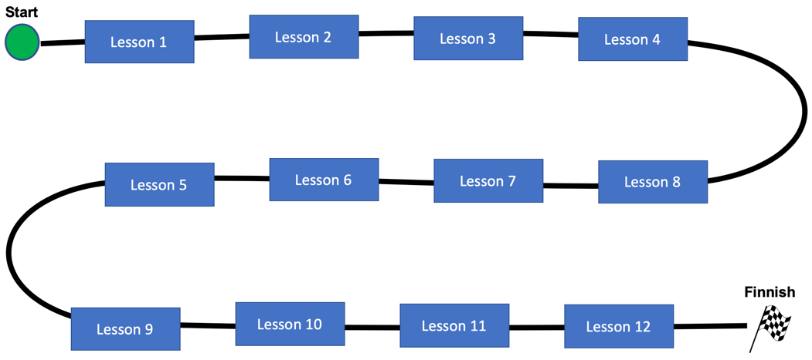

# Journey Maps for Online Courses

Keeping students focused is a key problem in online courses.  This document describes how we can use visual journey maps to keep online students focused on their goals.  This document is divided into two parts.  Part 1 describes what Journey Maps are and how they are used in our virtual CoderDojo mentoring sessions.  Part 2 targets at our mentors that are also helping create learning content and the colorful Journey Maps that go along with these courses.

# Part 1: Using Journey Maps With CoderDojo Students

## What are Journey Maps?
In a general sense, Journey Maps are a visualization of the process that a person goes through to accomplish a goal.  Journey Maps are used extensively by experts in the field of User Experience Design (UX).  In the context of developing virtual mentor assisted courses, we can use them as a way of keeping our students engaged, directing their focus toward a goal, and quickly reviewing out where students left off after a prior mentoring session with another mentor.

## Classroom Feedback vs Online Distractions
One of the challenges of online mentoring is keeping our students on track.  In a physical CoderDojo classroom when there are multiple students working together on a common goal, students observe each other working on projects. This feedback keeps them focused on reaching their educational goals.  Experienced teachers leverage the research on [Social constructivism](https://en.wikipedia.org/wiki/Social_constructivism#Education) in their course design.

 However, when we design online courses used in the home environment we don't have the luxury of these feedback systems to keep our students focused on reaching their learning goals.  There may be many distractions - other siblings, background TV noise, and other interruptions that our online mentors can see and can't control.  So to be successful we need to design courses to keep our students on task and bring them back to their learning objectives when they are distracted.

 One of the ways we can keep students focused is to create a clear mental model of the "map" of a course and then reinforce this map repeatedly until we reach the end of the course.  In a high-school or college course we have are often presented with a [syllabus](https://en.wikipedia.org/wiki/Syllabus) of the first day of a course.  This document is a lesson-by-lesson guide of the course so you can show students, administrators, and colleagues what we plan to teach in a course.  In our CoderDojo online mentoring sessions we can also use a graphic version of a syllabus to begin our sessions.  For our younger students we also want to make this document more fun and interactive.  We will call this document our Learning Journey Map.

 Creating a single page "map" allows our students to orient themselves using the same neural pathways they use when we walk around our home or their neighborhood.  Research has shown
 that creating these maps help us use specialized [Gird Cells](https://en.wikipedia.org/wiki/Grid_cell) in our brain to orient ourselves and do planning.

 ## The Learning Journey Map
A CoderDojo Online Learning Journey Map is a colorful single-page view of our course.  It is designed to be printed out on an 8.5X11 landscape piece of paper so that students can have it next to their computer and see where they are in the course.  The Journey Map allows them to both and see their progress toward reaching an objective.  It shows them what they have accomplished and what they still need to learn.

## The Components of a Journey Map
A Learning Journey Map has a clearly defined starting point, usually in the upper-left corner of the screen and a destination, often placed at the lower-right corner of the screen.  Each lesson is a waypoint on the road between the start and the end of the map.  A typical CoderDojo Online Journey map has between six and 20 lessons and is typically designed to take 2 to 3 1-hour sessions with an online mentor.

# Part 2: Creating Great Journey Maps

Now we want to focus on some of the design techniques that we want to use to create engaging Journey Maps for our CoderDojo online courses.  First, lets start with a basic boring Journey Map and then see how we can improve it to increase engagement.

## A Boring Journey Map

Here is an example of a boring journey map template:

Although we have a nice icon for the Start and Finish locations, the rest of the diagram is very plain.  There is no use of color and all the shapes are the same.  The journey map does not present a sense of adventure, challenges, and overcoming the challenge of learning new complex concepts.  It would be challenging for a student to remember where the last left off and the feeling is boring and repetition.

Here is a sample of a simple of another Journey Map

Let's take a look at a few more of the design aspects of this map.  First you will note that we are attempting to use different colors and shapes for each lesson.  This lets the students know that these lessons are all different and exciting!  We also are bringing in various icons form the lessons to help students remember where they might have left off.

## Journey Map Templates

## References

1. [Angela Stockman on K-12 Journey Maps](http://www.angelastockman.com/blog/2017/09/15/journey-maps-help-students-and-teachers-tell-their-learning-stories/)
2. [Journey Maps on Standford K-12 Wiki](https://dschool-old.stanford.edu/groups/k12/wiki/d8073/Journey_Map.html)
3. [Nielsen Norman Group on Journey Mapping](https://www.nngroup.com/articles/journey-mapping-101/#:~:text=Summary%3A%20A%20journey%20map%20is,Sarah%20Gibbons)
4. [Reader Rabbit](https://en.wikipedia.org/wiki/Reader_Rabbit#Educational_Goals) created a  early demonstration of Journey Maps as a navigational aid to a PC-based game for learning to read. [Reader Rabbit Reading 4-6 Full Walkthrough](https://www.youtube.com/watch?v=_UboUTZdclk&feature=youtu.be&t=160)