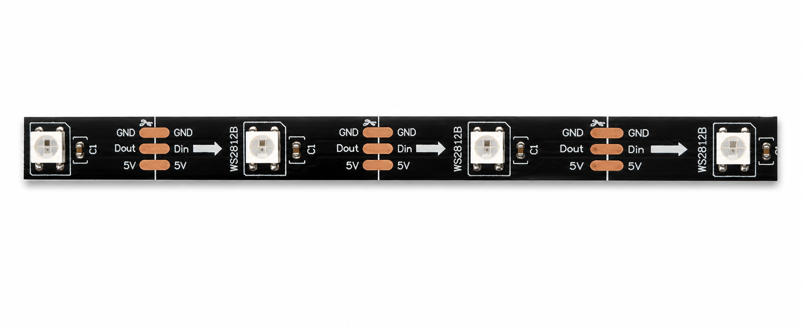
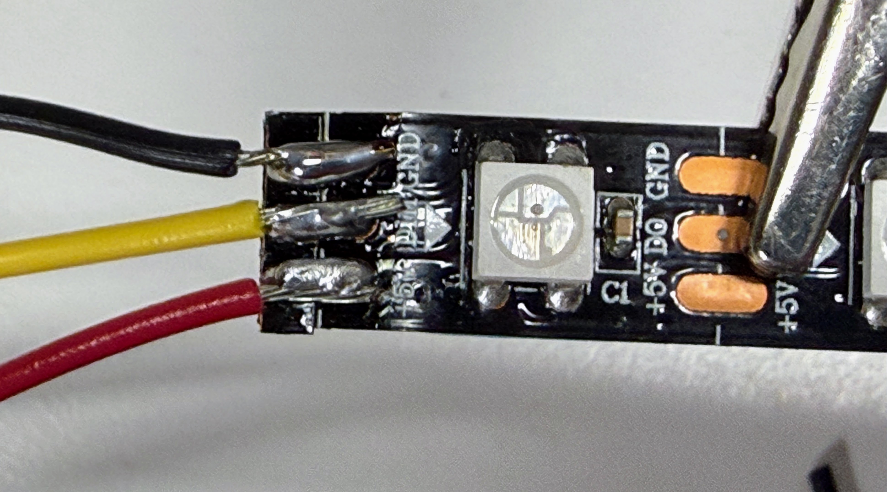

# Purchasing Guide for the {Kit Name} Kit

{One paragraph. What the finished kit does, what one kit costs all-in, what it
costs per student for a class of 20, and how far ahead a teacher needs to order
to get the cheap price. A teacher who reads only this paragraph should know
whether this kit fits their budget and their calendar.}

!!! note "Prices checked {Month Year}"
    Component prices move and marketplace listings turn over constantly. Treat
    every figure here as a planning estimate, not a quote.

## Summary of Parts List

**Required**

- [{Part name}](#anchor-slug) — {one clause on the job it does} (~${X})
- [{Part name}](#anchor-slug) — {one clause on the job it does} (~${X})

**Optional**

- [{Part name}](#anchor-slug) — {what it adds} (~${X})
- [{Part name}](#anchor-slug) — {what it adds} (~${X})

**Estimated total:** ~${X} for one kit · ~${Y} per student for a class of 20

---

<!-- ==================================================================
     One `##` section per part. Required parts first, in the same order
     as the summary list above. The worked example below shows the
     target depth — match it, do not just fill the slots.
     ================================================================== -->

## Addressable LED Strip (WS2812B)

The LED strip is what makes this kit worth building — a chain of WS2812B
"addressable" pixels, each containing a red, green and blue LED plus a small
controller that reads its own color off the data line and passes the rest
along. That single-wire chaining is why 30 pixels need only one GPIO pin.

We buy 1-meter strips at **60 pixels per meter** and cut each one in half, so
one strip yields two kits. Buy the **5V** version — the 12V WS2815 looks
identical in listing photos and will not run from the Pico's VBUS pin. **IP20**
(uncoated) is right for indoor classroom use; choose IP65 for take-home
projects and costumes.

**Prep work:** Cut the strip at the 30-pixel mark, following the copper pad
line. Solder 22-gauge **solid-core** wire to the three pads at the input end —
stranded wire will not seat in a breadboard. Slide colored heat shrink over
each lead before soldering and shrink it afterward; it strain-relieves the
joint, since WS2812B pads lift easily, and it color-codes power, ground and
data so students wire it correctly without tracing. Budget about 10 minutes per
strip.

**Cost:** ~$3–6 per meter from eBay or AliExpress · ~$3 per meter in a
classroom order direct from China. The same strip runs $10–15 per meter on
Amazon, so this part is where ordering ahead saves the most money.

**Search keywords:** `WS2812B LED strip 60 LED/m 5V`, `addressable RGB LED
strip`, `WS2812B IP20 1m`. Note that **"NeoPixel" is Adafruit's brand name** for
this part — searching it returns Adafruit product at several times the price for
an electrically identical strip.

**Where to buy:**

- [Search eBay for "WS2812B LED strip 60 LED/m 5V"](https://www.ebay.com/sch/i.html?_nkw=WS2812B+LED+strip+60+LED%2Fm+5V)
- [Search AliExpress for "WS2812B LED strip 60 LED/m 5V"](https://www.aliexpress.com/w/wholesale-ws2812b-led-strip-60-led-m-5v.html)
- [Search Amazon for "WS2812B LED strip 60 LED/m 5V"](https://www.amazon.com/s?k=WS2812B+LED+strip+60+LED%2Fm+5V)

---

## {Next Part}

{Two to four sentences: what it is, what job it does in this kit, and what a
buyer has to get right when choosing between listings.}

**Prep work:** {What happens between the box arriving and a student using it,
and roughly how long per kit. Write "None — it is breadboard-ready as shipped."
when there is none; that is useful information too.}

**Cost:** ~${X} each in quantity 1 · ~${Y} each in a classroom order of 20+
({what drives the difference}).

**Search keywords:** `{primary phrase}`, `{alias}`, `{part number}`

**Where to buy:**

- [Search eBay for "..."](...)
- [Search AliExpress for "..."](...)
- [Search Amazon for "..."](...)

---

## Purchasing Strategy

**Lead time is the real tradeoff.** Direct-from-China listings on AliExpress and
many eBay sellers run 40–70% cheaper than Amazon for the same commodity part,
at 2–3 weeks of transit — sometimes 4–6 weeks around Lunar New Year, when
Chinese factories and shipping largely stop. Order a semester ahead and the
savings are free; order the week before the unit starts and you pay the Amazon
premium for the privilege.

**Buy one, then buy twenty.** Order a single unit from a seller, confirm it is
the right part, then place the classroom order with that same seller. Listings
for commodity parts vary in quality far more than the photos suggest.

**Order spares.** Add 10–15% over the class count. Buttons get lost, strips get
cut short, someone reverses power and ground. Spares are cheaper than a dead
station in the middle of a lesson.

**Watch the pack sizes.** Most of the classroom savings comes from pack
breakpoints — breadboards in tens, buttons in hundreds — not from negotiated
discounts. Round the order up to the pack, not to the roster.

**Check your district's purchasing rules first.** Many districts cannot
reimburse AliExpress or direct international orders and require a domestic
vendor with a W-9. If that is your constraint, the Amazon column is your real
price.

## Classroom Order Worksheet

| Part | Required? | Qty per kit | Qty for 20 kits | Est. cost for 20 |
|------|-----------|-------------|-----------------|------------------|
| {Part} | Required | 1 | 20 (2 packs of 10) | $XX |
| {Part} | Required | 2 | 40 (1 pack of 100) | $XX |
| {Part} | Optional | 1 | 20 | $XX |
| | | | **Required subtotal** | **$XXX** |
| | | | **With optional parts** | **$XXX** |

**Per student:** ~${X} required · ~${Y} with optional parts

### Shared classroom tools

Bought once and reused for years, so keep them out of the per-student figure.

| Tool | Cost | How many |
|------|------|----------|
| Soldering iron | $15–40 | 1 per 4–6 students |
| Solder | $8–15 | 1 spool per classroom |
| Wire strippers | $8–15 | 1 per pair |
| Heat gun | $15–25 | 1 per classroom |
